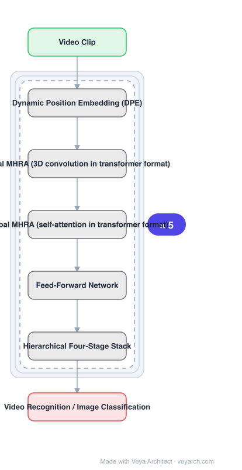

# Architecture: UniFormer

## Motivation

Video networks face two structural problems. **3D convolution** reduces complexity by factorizing kernels and models local patterns well, but **struggles to capture long-range dependency** because of its limited receptive field. **Self-attention** captures long-range dependency, but it is **inefficient at encoding low-level features** — Video Swin applies self-attention in a local 3D window, and that inefficiency hinders the model's potential. The paper names the two problems it targets directly: **spatiotemporal redundancy** and **dependency**.

## Core Idea

A **Unified transFormer (UniFormer)**: use the basic transformer format, but put **3D convolution** in it for local features and **self-attention** for global. Both are expressed through a **Multi-Head Relation Aggregator (MHRA)**, so convolution and attention are two instantiations of one module in one format. Blocks stack hierarchically.

## Architecture

### Overview

<b>Layer-by-layer (7 nodes)</b>

| # | Layer | Type | Params |
|---|---|---|---|
| 1 | Video Clip | `input` |  |
| 2 | Dynamic Position Embedding (DPE) | `custom` |  |
| 3 | Local MHRA (3D convolution in transformer format) | `custom` |  |
| 4 | Global MHRA (self-attention in transformer format) | `custom` |  |
| 5 | Feed-Forward Network | `custom` |  |
| 6 | Hierarchical Four-Stage Stack | `custom` |  |
| 7 | Video Recognition / Image Classification | `output` |  |

### Components

1. **Dynamic Position Embedding (DPE)** — the first of the three key modules in a UniFormer block.
2. **Multi-Head Relation Aggregator (MHRA)** — the unifying module; instantiated as **local MHRA** (3D convolution) in early stages and **global MHRA** (self-attention) in later stages.
3. **Local MHRA** — 3D convolution in a concise transformer format, for efficient local feature encoding.
4. **Global MHRA** — self-attention in transformer format, for long-range dependency.
5. **Feed-Forward Network (FFN)** — the third module of the block.
6. **Hierarchical four-stage stack** — blocks stacked hierarchically, following prior hierarchical designs.

### Data Flow

Video clip → hierarchical stages; early stages use local MHRA (3D convolution in transformer format), later stages use global MHRA (self-attention), each with DPE and FFN; resolution/channels change across stages → video recognition head (also usable for image classification).

### State / Memory

No recurrent state. The efficiency argument is that early, high-resolution, low-level stages are where self-attention wastes compute, so those stages use convolution and only later stages pay for attention.

## Design Decisions

- **Unify convolution and attention in one format** — the block is a basic transformer format, with the aggregator's instantiation differing; that is the "unified" claim.
- **Convolution where attention is wasteful** — local MHRA as 3D convolution addresses the inefficiency of encoding low-level features with self-attention.
- **Attention where long range matters** — global MHRA addresses the limited receptive field of 3D convolution.
- **Explicitly target redundancy and dependency** — the two named problems, mapped to the two aggregator forms.
- **Follow hierarchical designs** — the stack is hierarchical, as in prior video backbones.

## Evolution

- **2D/3D CNNs** (predecessors): good locally, limited long-range dependency.
- **Transformer video networks built on ViT** (predecessors): strong long-range, inefficient on low-level features.
- **MViT** (contrast): hierarchical structure with pooling self-attention.
- **Video Swin** (contrast): applies self-attention in a local 3D window.
- **UniFormer (2022)**: local MHRA = 3D conv, global MHRA = self-attention, one format.
- **Siblings**: VideoMAE, TimeSformer, ViViT, SlowFast.

## Characteristics

| Property | Value |
|---|---|
| Task | video recognition (also image classification) |
| Block modules | DPE, MHRA, FFN |
| Local path | local MHRA = 3D convolution in transformer format |
| Global path | global MHRA = self-attention in transformer format |
| Structure | hierarchical four-stage stack |
| Targets | spatiotemporal redundancy and dependency |

## Limitations

- Choosing which stages are local versus global is a design decision that must be tuned per dataset/compute budget.
- 3D convolution in early stages still carries meaningful compute at high resolution.
- The unified format is elegant but means neither path is specialized.
- Evaluated on video recognition; very long-form temporal modelling beyond a clip is not addressed.

## Implementation Notes

Essentials: (1) instantiate MHRA as 3D convolution in the early stages and self-attention in the later stages — using self-attention everywhere is the Video Swin inefficiency the paper names, and using convolution everywhere loses long-range dependency, (2) keep both paths in the same transformer-format block (DPE + MHRA + FFN); two separate unrelated module types would drop the unified claim, (3) include Dynamic Position Embedding, which is one of the three named block modules, (4) stack blocks hierarchically in stages rather than uniformly, (5) report efficiency as well as accuracy, since the motivation is that self-attention is inefficient for low-level features — accuracy-only comparison does not test the claim.
