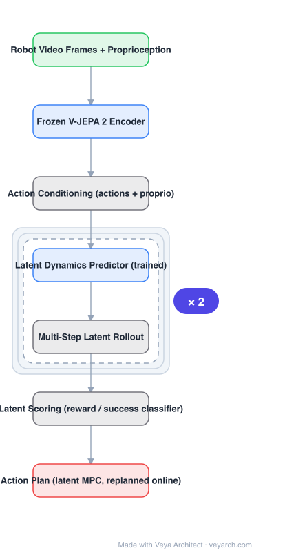

# Architecture: V-JEPA 2-AC

## Motivation

Robot learning wants world models, but generative (pixel-space) world models are expensive to train and query, while model-free RL is data-hungry per task. The V-JEPA 2 paper's bet: a video representation pretrained with **masked latent prediction on 1M+ hours of action-free video** already contains the dynamics needed for manipulation — all that is missing is a small, action-conditioned head that learns how actions move through that latent space.

## Core Idea

**Freeze the representation; train only the dynamics.** Attach an action-conditioned predictor to a frozen V-JEPA 2 encoder. Given the current frames' latents, the robot's proprioception, and a candidate action sequence, the predictor rolls out future latents. Planning is model-predictive control in latent space: sample action candidates, roll them forward, score the resulting latents (e.g., with a reward classifier over latents), execute the best first action, and replan.

## Architecture

### Overview

<b>Layer-by-layer (7 nodes)</b>

| # | Layer | Type | Params |
|---|---|---|---|
| 1 | Robot Video Frames + Proprioception | `input` |  |
| 2 | Frozen V-JEPA 2 Encoder | `attention` |  |
| 3 | Action Conditioning (actions + proprio) | `custom` |  |
| 4 | Latent Dynamics Predictor (trained) | `attention` |  |
| 5 | Multi-Step Latent Rollout | `custom` |  |
| 6 | Latent Scoring (reward / success classifier) | `custom` |  |
| 7 | Action Plan (MPC, replanned online) | `output` |  |

### Components

1. **Frozen V-JEPA 2 encoder** — the self-supervised video backbone (see [`../v-jepa-2/`](../v-jepa-2/architecture.md)); its latents are the world state.
2. **Action conditioning** — robot actions and proprioceptive state are injected into the predictor so latents evolve consistently with the robot's motion.
3. **Latent dynamics predictor** — the only trained module besides the scorer; a relatively small transformer that maps (current latents, action) → next latents, applied recurrently for multi-step rollouts.
4. **Latent scorer** — a classifier/regressor over rolled-out latents (e.g., task success / reward) used to rank action candidates.
5. **MPC loop** — sample candidates → roll out → score → execute best first step → observe → replan; replanning absorbs rollout drift.

### Data Flow

Pretraining side (V-JEPA 2): action-free video → masked latent prediction. World-model side: robot video (Droid, <62h, unlabeled) → frozen encoder → latents; predictor trained to predict future latents given actions + proprioception. Planning side: (frames, proprio) → latents → for each candidate action sequence, rollout → score → best plan → execute step 1 → replan.

### State / Memory

The planner keeps latent state across rollout steps within an MPC horizon, but the encoder itself is stateless (clip-wise). Rollout drift over long horizons is handled by replanning rather than by memory.

## Design Decisions

- **Freeze the backbone** — robot data is too scarce to safely fine-tune a large video model; freezing makes 62 hours enough and preserves the general representation.
- **Predict latents, not pixels** — rollout cost stays low and the model cannot waste capacity on photometrics; planning needs *where things will be*, not *how it looks*.
- **Score latents with a separate head** — decouples "predict what happens" from "is that good", so the same dynamics model serves many tasks with different scorers.
- **Replan instead of long open-loop** — acknowledges latent rollout drift explicitly.

## Evolution

- **I-JEPA → V-JEPA → V-JEPA 2**: latent-prediction SSL scaled to 1M+ hours of video (see [`../v-jepa-2/`](../v-jepa-2/architecture.md)).
- **V-JEPA 2-AC**: adds the action-conditioned predictor + latent MPC — the first of this line to control physical robots zero-shot.
- **Contrast**: Dreamer-family world models (reconstruct pixels, train policies by backprop through imagination); UniPi-style video-generation planners (generate then evaluate pixels). V-JEPA 2-AC sits at the cheap-prediction extreme: no reconstruction at all.

## Characteristics

| Property | Value |
|---|---|
| Task | action-conditioned video prediction; robot planning (MPC) |
| Representation | frozen V-JEPA 2 latents |
| Trained modules | latent dynamics predictor + latent scorer |
| Robot data | <62 h unlabeled robot video (Droid) + human egocentric video |
| Control | latent-space MPC, replanned online |
| Demonstrated | zero-shot pick-and-place on Franka arms, two labs |

## Limitations

- Demonstrated on Franka arms with a specific action space; cross-embodiment generalization unverified.
- No pixel decoding — impossible to visually inspect predicted futures for debugging.
- Long-horizon rollouts drift; the system depends on frequent replanning.
- Latent scoring heads are task-specific even though the dynamics model is general.

## Implementation Notes

Essentials: (1) never fine-tune the encoder — train predictor and scorer only, (2) condition the predictor on proprioception as well as actions, (3) keep rollouts short and replan rather than extending the horizon, (4) rank candidate action sequences by a classifier over *final* rolled-out latents. The frozen-backbone discipline is the load-bearing decision: it is what converts a robot-data scarcity problem into a small-supervised-head problem.

## Relevance to Veya

The concrete template for **Veya-World as a latent world model**: frozen perception latent (Veya's shared visual encoder) + small action-conditioned dynamics head + latent MPC. It validates the architecture Veya wants — world modeling does not require generative video, and embodied control can ride on a video foundation model without fine-tuning it. For Physical-World AI on robot hardware, the "freeze representation, train only dynamics on hours-not-millions of data" economics is the single most consequential design fact in this package.
