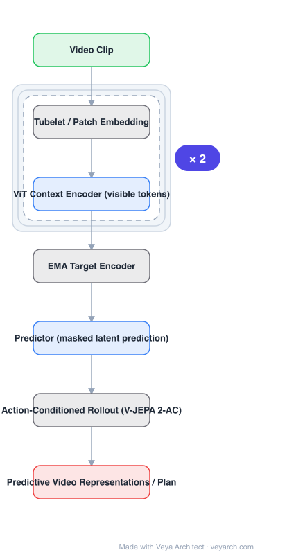

# Architecture: V-JEPA 2

## Motivation

Two families of video models exist: generative (predict pixels) and predictive (predict features). Generative models spend capacity on photometric detail and scale poorly to long horizons; predictive models trained in representation space are cheaper but historically weaker downstream. V-JEPA 2 tests whether scaling the **masked latent-prediction** recipe to a million hours of video produces representations good enough for understanding **and** for action-conditioned prediction/planning.

## Core Idea

Mask large spatio-temporal regions of a video, encode the visible parts, and **predict the representations of the masked regions** — where the targets come from an **EMA copy** of the encoder, not from pixels. The loss is entirely in latent space. Then attach an **action-conditioned predictor** on top (V-JEPA 2-AC) that rolls the latent forward given actions, which is the world model used for planning.

## Architecture

### Overview

<b>Layer-by-layer (7 nodes)</b>

| # | Layer | Type | Params |
|---|---|---|---|
| 1 | Video Clip | `input` |  |
| 2 | Tubelet / Patch Embedding | `custom` |  |
| 3 | ViT Context Encoder (visible tokens) | `attention` |  |
| 4 | EMA Target Encoder | `custom` |  |
| 5 | Predictor (masked latent prediction) | `attention` |  |
| 6 | Action-Conditioned Rollout (V-JEPA 2-AC) | `custom` |  |
| 7 | Predictive Video Representations / Plan | `output` |  |

### Components

1. **Tubelet / patch embedding** — video is tokenized into spatio-temporal patches (tubelets); a large fraction of tokens is masked out.
2. **Context (target-aware) encoder** — a ViT that processes only the **visible** tokens; masking before the encoder is what makes training cheap.
3. **EMA target encoder** — a copy of the encoder updated by exponential moving average, which produces the prediction targets from the full (unmasked) video. No gradients flow through it; this is what prevents representation collapse without contrastive negatives.
4. **Predictor** — a smaller transformer that takes the context encoder's outputs plus mask tokens and predicts the target features of the masked regions.
5. **Loss** — L1/L2-style regression between predicted and target latents over masked regions only.
6. **V-JEPA 2-AC (action-conditioned world model)** — the frozen representation is conditioned on actions and proprioception, and trained to predict future latents; it is then used for planning/model-predictive control.
7. **LLM adapter** — the video representations are aligned to an LLM for video question answering.

### Data Flow

Video clip → mask tubelets → context encoder (visible tokens) → predictor → predicted latents for masked regions; EMA target encoder provides targets → latent regression loss. For planning: frames + actions → frozen encoder → action-conditioned predictor → rollout of future latents → plan scoring.

### State / Memory

No recurrent state in the encoder. The **EMA target encoder** is a persistent, slowly-updated copy — its momentum is the "memory" that makes the targets stable across training. Planning rollouts keep a latent state across steps.

## Design Decisions

- **Predict in latent space** — avoids pixel reconstruction cost and photometric overfitting.
- **Mask before the encoder** — visible-token-only encoding makes large masks cheap.
- **EMA targets instead of negatives** — no contrastive pairs, no decoder, no pixel loss; collapse is avoided by the asymmetric (stop-gradient, momentum) target branch.
- **Action conditioning as a separate, lightweight stage** — the representation is frozen; only the planner is trained on robot data, which is why 62 hours of robot video is enough.

## Evolution

- **Contrastive video SSL / VideoMAE** (predecessors): pixel reconstruction or contrastive pairs.
- **I-JEPA**: image latent prediction with EMA targets.
- **V-JEPA**: extends to video with tubelet masking.
- **V-JEPA 2**: scaled to 1M+ hours, adds V-JEPA 2-AC for zero-shot robot planning on Franka arms.
- **Siblings**: DINOv2 (image SSL, features used everywhere), VGGT-World (geometry latents from a frozen 3D model), Dreamer-style latent world models (reconstructive, RL-driven).
- **Competitors**: generative video world models (pixel-space), navigation/occupancy world models.

## Characteristics

| Property | Value |
|---|---|
| Task | self-supervised video representation + action-conditioned prediction |
| Tokenizer | spatio-temporal tubelets, heavy masking |
| Encoder | ViT on visible tokens only |
| Targets | EMA (momentum) encoder, stop-gradient |
| Loss | latent regression over masked regions |
| Scale | >1M hours of video; V-JEPA 2-AC from <62 h robot video |

## Limitations

- Latent-space training means no generative output — you cannot decode pixels for visualization or simulation.
- Very large-scale pretraining cost; not reproducible without significant compute.
- Zero-shot robot results were demonstrated on Franka arms with a specific action space; generalization across embodiments is unverified.
- Long-horizon rollouts still drift; planning needs re-planning/MPC rather than a single open-loop rollout.

## Implementation Notes

Essentials: (1) tokenize with tubelets and mask a large fraction before the encoder, (2) run the encoder only on visible tokens, (3) keep an EMA target encoder with stop-gradient and no decoder, (4) regress predicted vs. target latents on masked positions, (5) freeze the representation and train a small action-conditioned predictor for planning. Do not add pixel reconstruction — it is the thing this design deliberately avoids.
