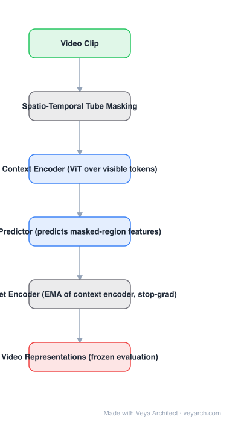

# Architecture: V-JEPA

## Motivation

Two families dominate video self-supervision, and both spend capacity on the wrong thing. **Pixel reconstruction** (VideoMAE-style) forces the model to model every texture detail, most of it unpredictable and irrelevant. **Contrastive / image-encoder-init** methods need negatives or a pretrained image backbone. V-JEPA's claim: predicting **features of masked regions** avoids both, and is more label-efficient.

## Core Idea

Joint-embedding predictive architecture for video: mask spatio-temporal tubes, encode the visible context with a ViT, and train a **predictor** to output the representations of the masked regions. The targets come from a **target encoder that is an EMA of the context encoder** with stop-gradient — no pixels, no negatives, no decoder.

## Architecture

### Overview

<b>Layer-by-layer (6 nodes)</b>

| # | Layer | Type | Params |
|---|---|---|---|
| 1 | Video Clip | `input` |  |
| 2 | Spatio-Temporal Tube Masking | `custom` |  |
| 3 | Context Encoder (ViT over visible tokens) | `attention` |  |
| 4 | Predictor (predicts masked-region features) | `attention` |  |
| 5 | Target Encoder (EMA of context encoder, stop-grad) | `custom` |  |
| 6 | Video Representations (frozen evaluation) | `output` |  |

### Components

1. **Spatio-temporal tube masking** — mask blocks that span time, so the objective cannot be solved by spatial inpainting alone.
2. **Context encoder (ViT)** — processes only the visible tokens; this is the model that is kept after training.
3. **Target encoder** — an **exponential moving average** of the context encoder, applied to the full clip (including masked regions) to produce prediction targets; gradients are stopped through it.
4. **Predictor** — a narrower transformer that maps context features (+ mask tokens) to predicted target features for masked regions; **discarded at evaluation**.
5. **Loss** — regression (smooth-L1 style) between predicted and target features in representation space.
6. **Evaluation** — freeze the encoder, train a lightweight probe/attentive probe on top.

### Data Flow

Video clip → mask tubes → context encoder (visible tokens) → predictor → predicted features for masked regions ⟷ target encoder (EMA, stop-grad) features for the same regions. At evaluation: clip → context encoder → frozen features → probe.

### State / Memory

The EMA target encoder is the only "memory" — a slow copy of the weights that provides stable targets and is what prevents collapse without contrastive negatives.

## Design Decisions

- **Predict features, not pixels** — the paper's central argument: pixel prediction spends capacity on irreducible detail, feature prediction does not.
- **EMA target encoder + stop-gradient** — the collapse-prevention mechanism; no negatives and no asymmetric predictor tricks required.
- **Tube masking** — forces temporal reasoning.
- **Discard the predictor** — the encoder is the artifact; the predictor is scaffolding.
- **No pretrained image encoder** — trained from scratch on video, unlike CLIP-initialized pipelines.

## Evolution

- **MAE / VideoMAE** (pixel reconstruction) and **contrastive video SSL** (predecessors/contrasts).
- **I-JEPA (2023)**: the same feature-prediction idea for images.
- **V-JEPA (2024)**: extends to video with tube masking and an EMA target encoder.
- **Successors**: **V-JEPA 2** (scaled, with action-conditioned world-model use), **V-JEPA 2.1** (dense features).
- **Siblings**: DINO / DINOv2 (self-distillation), data2vec, VideoMAE v2.

## Characteristics

| Property | Value |
|---|---|
| Task | self-supervised video representation learning |
| Encoder | ViT over visible tokens |
| Target | EMA copy of the encoder, stop-gradient |
| Prediction space | representation (feature) space, not pixels |
| Masking | spatio-temporal tubes |
| Evaluation | frozen encoder + probe |

## Limitations

- Feature-prediction collapse is avoided by the EMA, but the learned representation can still be "blurrier" than pixel-space models for dense tasks (V-JEPA 2.1 explicitly targets dense features).
- The predictor is thrown away, so its capacity does not help downstream — all quality must live in the encoder.
- Requires a lot of video and a long schedule; EMA-target SSL is sensitive to the EMA schedule and masking ratio.
- No generative ability: it cannot produce video or depth, only representations.

## Implementation Notes

Essentials: (1) mask contiguous spatio-temporal tubes with a high masking ratio, (2) run the context encoder on visible tokens only, (3) maintain the target encoder as an EMA of the context encoder *with stop-gradient* — this is the collapse safeguard, (4) train the predictor with a regression loss in feature space, (5) evaluate by freezing the encoder and training a probe; never report the predictor's output as the representation.
