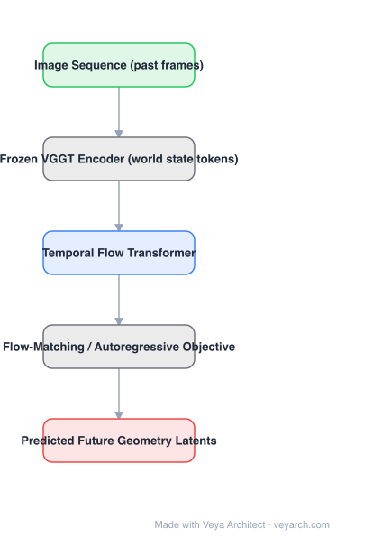

# Architecture: VGGT-World

## Motivation

World models usually forecast future video frames. That is expensive: most of the model's capacity goes to photometric detail (textures, lighting), and the resulting predictions are frequently geometrically inconsistent — a scene can look plausible and still violate 3D structure. For embodied and planning use, geometry is what matters, pixels are a proxy.

## Core Idea

Split the problem: use a **frozen geometry foundation model (VGGT)** to encode each frame into latent tokens that already carry cameras, depth, and point maps — that is the **world state** — and learn only the **dynamics**: a lightweight temporal flow transformer that autoregressively predicts the future trajectory of those tokens. No video is generated, and only the temporal part is trained.

## Architecture

### Overview

<b>Layer-by-layer (5 nodes)</b>

| # | Layer | Type | Params |
|---|---|---|---|
| 1 | Image Sequence (past frames) | `input` |  |
| 2 | Frozen VGGT Encoder (world state tokens) | `custom` |  |
| 3 | Temporal Flow Transformer | `attention` |  |
| 4 | Flow-Matching / Autoregressive Objective | `custom` |  |
| 5 | Predicted Future Geometry Latents | `output` |  |

### Components

1. **Frozen VGGT encoder** — each frame (or a past window) is encoded by VGGT with weights frozen; its latent tokens become the world state representation. Freezing means all of VGGT's 3D competence is reused for free and the state is already geometry-aware.
2. **World-state token sequence** — the per-frame latent tokens form a sequence over time; this sequence is the object the model learns to roll forward.
3. **Temporal flow transformer** — a lightweight transformer that takes the past token sequence (and optionally actions) and predicts the next-step token distribution; the paper uses a flow-matching-style objective, which is more stable than regression in this high-dimensional latent space.
4. **Autoregressive rollout** — predictions are fed back to extend the horizon; the two named challenges are high-dimensional latent dynamics and drift/compounding error over long horizons.
5. **Decoding (optional)** — because the state is a VGGT latent, predicted states can be decoded into geometry (cameras, depth, point maps) for evaluation or planning.

### Data Flow

Past frames → frozen VGGT → state tokens per frame → temporal flow transformer → predicted next state tokens → (fed back for multi-step rollout) → optional decode to camera/depth/point map.

### State / Memory

Explicit world state: the VGGT token sequence. Autoregressive rollout means predictions become inputs, so error accumulation is the defining behavior — analogous to a recurrent model whose hidden state is a geometry latent.

## Design Decisions

- **Forecast geometry, not pixels** — the central decision; removes photometric modeling cost and improves geometric consistency.
- **Frozen foundation encoder** — only the dynamics are learned, drastically reducing data and compute needs.
- **Flow-matching-style objective** — better suited to high-dimensional continuous latents than MSE regression.
- **Latent-space world state** — makes the model usable by planners that need geometry, while keeping the rollout cheap.

## Evolution

- **Generative video world models** (predecessors): Dreamer / IRIS / video diffusion predictors — pixel-space, expensive, geometrically inconsistent.
- **Latent predictive models**: V-JEPA / I-JEPA — predict in representation space, but with a generic video encoder.
- **Geometry foundation models**: VGGT — provides the frozen encoder and the state representation.
- **VGGT-World**: combines the two — geometry-latent autoregressive world model without video generation.
- **Siblings**: action-conditioned variants (navigation/embodied world models), occupancy world models (OccWorld), driving world models.

## Characteristics

| Property | Value |
|---|---|
| Task | autoregressive geometry world modelling |
| State encoder | frozen VGGT (no gradient) |
| Dynamics | lightweight temporal flow transformer |
| Objective | flow matching / latent next-step prediction |
| Rollout | autoregressive (feedback of predicted states) |
| Output | predicted future geometry latents (decodable to camera/depth/points) |

## Limitations

- Rollout drift: error compounds with horizon, as in any autoregressive world model.
- The frozen encoder caps what the state can represent; novel scene types outside VGGT's training distribution are poorly encoded.
- Evaluation of latent predictions is indirect — quality is judged through decoded geometry or downstream tasks.
- Real-time use requires running VGGT per step unless the state is predicted directly; the encoder remains the compute bottleneck.

## Implementation Notes

Essentials: (1) run VGGT in `no_grad` to build per-frame state tokens, (2) train a small transformer to predict the next state with a flow-matching or diffusion-style objective on the latents, (3) evaluate with multi-step rollout to expose drift, (4) decode to camera/depth/point maps for sanity checks. Keep the encoder frozen — fine-tuning it breaks the "learn only the dynamics" property that makes the approach cheap.
