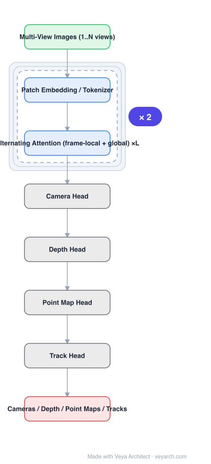

# Architecture: VGGT

## Motivation

3D reconstruction pipelines — even feed-forward ones like DUSt3R/MASt3R — produce one attribute (pointmaps) and then need optimization (matching, bundle adjustment, global alignment) to recover cameras, depth, and tracks. VGGT asks whether a single transformer can predict **all** of those attributes directly in one forward pass, with as little 3D-specific machinery as possible.

## Core Idea

Treat multi-view 3D as sequence modelling: tokenize every view, run a large transformer with **alternating attention** (frame-local attention inside a view, global attention across views), and attach small heads for camera, depth, point map, and tracking. Train them jointly — the tasks are complementary, and the multi-task supervision is what lets one network replace a pipeline.

## Architecture

### Overview

<b>Layer-by-layer (8 nodes)</b>

| # | Layer | Type | Params |
|---|---|---|---|
| 1 | Multi-View Images (1..N views) | `input` |  |
| 2 | Patch Embedding / Tokenizer | `conv2d` |  |
| 3 | Alternating Attention (frame-local + global) ×L | `attention` |  |
| 4 | Camera Head | `custom` |  |
| 5 | Depth Head | `custom` |  |
| 6 | Point Map Head | `custom` |  |
| 7 | Track Head | `custom` |  |
| 8 | Cameras / Depth / Point Maps / Tracks | `output` |  |

### Components

1. **Tokenizer / patch embedding** — each view is split into patches and embedded; a special camera token and register tokens are appended.
2. **Alternating attention backbone** — a stack of transformer layers where attention alternates between **frame-local** (within one view's tokens) and **global** (over all tokens of all views). This gives multi-view reasoning without paying global attention cost at every layer.
3. **Camera head** — predicts intrinsics and extrinsics per frame from the camera/register tokens.
4. **Depth head** — dense per-view depth, supervised where ground truth exists.
5. **Point map head** — dense 3D points per view in a common frame (the DUSt3R-style representation).
6. **Track head** — 3D point tracks across views, using the same token space (the DINO-style feature/Track head formulation).
7. **Joint multi-task loss** — camera, depth, point map, and track losses summed with weights; no explicit geometric solver inside the network.

### Data Flow

N views → tokenize → alternating attention stack → four heads → cameras + depth + point maps + tracks. Nothing is optimized at inference for the standard use case; additional refinement (e.g. bundle adjustment) is optional.

### State / Memory

No recurrent state, but the global-attention layers hold **all views in context at once** — memory, not recurrence, is the multi-view mechanism. This is why view count is the practical limit.

## Design Decisions

- **Minimal 3D inductive bias** — no epipolar module, no cost volume, no matching solver; the paper's bet is that a large transformer learns geometry from data.
- **Alternating attention** — the efficiency trick that makes many views affordable: local attention handles per-image detail, global attention handles cross-view consistency.
- **Multi-task outputs from one token space** — depth/point map/track heads share features, so predicting one helps the others.
- **One forward pass** — removes the optimization stage that dominates latency in SfM-style pipelines.

## Evolution

- **SfM / MVS and COLMAP** (predecessors): iterative optimization pipelines.
- **DUSt3R**: feed-forward pointmaps, still needs alignment.
- **MASt3R**: adds matching; still pairwise.
- **VGGT**: single pass, all attributes, arbitrary view count.
- **VGGT-World**: reuses frozen VGGT tokens as a world state for an autoregressive geometry world model.
- **Siblings**: Fast3R (many views in one pass), π³ (permutation-equivariant multi-view reconstruction).

## Characteristics

| Property | Value |
|---|---|
| Task | feed-forward multi-view 3D (cameras, depth, point maps, tracks) |
| Attention | alternating frame-local / global |
| Heads | camera, depth, point map, track |
| Views | 1 … hundreds |
| Output | all 3D attributes in one forward pass |
| 3D priors | minimal (learned, not geometric modules) |

## Limitations

- Global attention over all views is quadratic in tokens; very long sequences require windowing or subsampling.
- No optimization step means no guarantee of multi-view geometric consistency in hard cases.
- Metric scale and long-sequence drift are still open issues; very large scenes may still benefit from alignment.
- Model size and activation memory make on-device deployment of the full model impractical; distillation or view subsampling is needed.

## Implementation Notes

The essential structure: patch tokens + special camera/register tokens → alternating local/global attention blocks → four lightweight heads with a weighted multi-task loss. The alternating attention schedule (local for most layers, global at a subset) is the part that determines both accuracy and memory; keep the number of global layers configurable so view count can be traded against memory.
