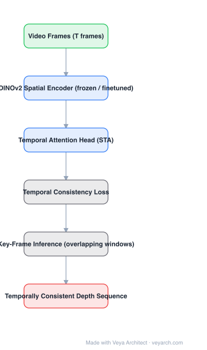

# Architecture: Video Depth Anything

## Motivation

Applying a single-image depth model per video frame produces depth that is individually plausible but **temporally inconsistent**: flicker between frames, scale drift over long sequences, and no notion of motion. Video Depth Anything keeps the strong image model and adds the minimum structure needed to make depth *stable across time*, including for arbitrarily long videos.

## Core Idea

Do not retrain video depth from scratch. Keep the **spatial encoder** from Depth Anything (it already produces excellent per-frame depth) and attach a **temporal head** that conditions each frame on its neighbors; supervise it with a **temporal consistency loss** that penalizes the temporal depth gradient rather than only per-frame error.

## Architecture

### Overview

<b>Layer-by-layer (6 nodes)</b>

| # | Layer | Type | Params |
|---|---|---|---|
| 1 | Video Frames (T frames) | `input` |  |
| 2 | DINOv2 Spatial Encoder (frozen / finetuned) | `conv2d` |  |
| 3 | Temporal Attention Head (STA) | `attention` |  |
| 4 | Temporal Consistency Loss | `custom` |  |
| 5 | Key-Frame Inference (overlapping windows) | `custom` |  |
| 6 | Temporally Consistent Depth Sequence | `output` |  |

### Components

1. **Spatial encoder (DINOv2-based, from Depth Anything)** — per-frame features and an initial depth estimate; the source of per-frame accuracy and open-domain robustness.
2. **Temporal head (spatio-temporal attention)** — lightweight attention over a window of frames so each frame's depth is informed by its neighbors; this is the added capacity, deliberately small.
3. **Temporal consistency loss** — constrains the temporal depth gradient (the change of depth over time for corresponding points), directly penalizing flicker and short-term drift.
4. **Long-video inference strategy** — processing is organized over segments anchored by key frames so that a video of arbitrary length is handled with bounded memory while staying consistent across segment boundaries.
5. **Depth head** — outputs the final depth sequence; the relative-depth nature of the base model is inherited unless metric supervision is added.

### Data Flow

Video frames → spatial encoder (per frame) → temporal head over a frame window → depth maps → temporal-consistency supervision; long videos → segment/key-frame scheduling → stitched consistent depth.

### State / Memory

The temporal head's window is the short-term state; for long videos, the key-frame/segment state carried across windows is what prevents drift.

## Design Decisions

- **Reuse the image model** — video depth data is scarce; single-image depth supervision is abundant and high quality.
- **Temporal head, not a full video transformer** — keeps cost near linear in frames and preserves per-frame accuracy.
- **Gradient-based consistency loss** — penalizes *change over time*, which is exactly the artifact users see, instead of only smoothing globally.
- **Segment scheduling for long videos** — the practical answer to "arbitrarily long" given bounded memory.

## Evolution

- **Depth Anything V1/V2** (predecessors): excellent single-image relative depth, no temporal modeling.
- **Video Depth Anything**: temporal head + temporal consistency loss + long-video scheduling.
- **Siblings**: DepthCrafter (diffusion-based video depth), NVDS (stereo-assisted, temporally consistent), ChronoDepth, RollingDepth, MonoDepth-Video.
- **Online/streaming successors** (e.g. Online Video Depth Anything): causal, low-memory variants for real-time use.
- **Related**: metric video depth via MoGe-2 or VGGT-style point maps.

## Characteristics

| Property | Value |
|---|---|
| Task | temporally consistent monocular video depth |
| Spatial encoder | DINOv2-based (from Depth Anything) |
| Temporal module | lightweight spatio-temporal attention head |
| Loss | depth loss + temporal consistency loss (temporal gradient) |
| Inference | segment / key-frame scheduling for long videos |
| Output | relative depth sequence (metric variants need extra supervision) |

## Limitations

- Relative depth by default; metric scale requires additional supervision or a metric backbone.
- Consistency is enforced locally (within window/segment); very long sequences can still drift.
- Dynamic objects and occlusions violate the temporal-gradient assumption and can be over-smoothed.
- Cost grows with window size; real-time use needs a causal/online variant.

## Implementation Notes

Essentials: (1) start from a strong single-image depth model and keep its weights mostly intact, (2) add a small temporal attention head over a frame window, (3) add a temporal-gradient consistency term to the loss, (4) implement segment/key-frame stitching for long inputs with overlap so boundaries stay consistent. Evaluate both per-frame accuracy and temporal stability — good per-frame metrics alone do not imply flicker-free output.
