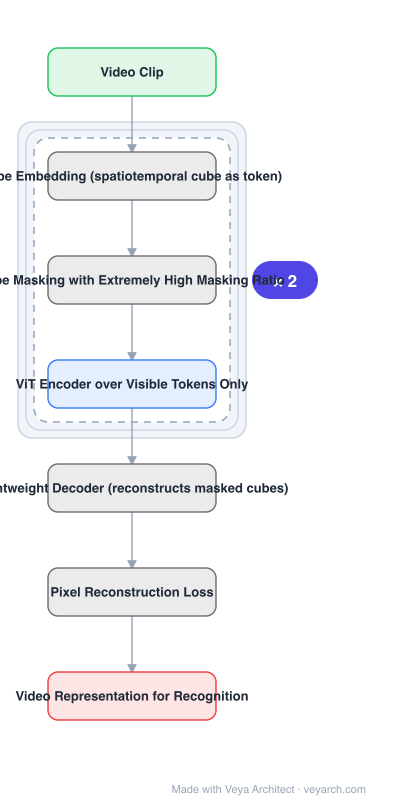

# Architecture: VideoMAE

## Motivation

Masked autoencoding worked well for images, but video looks like a poor fit for two named reasons. **Temporal redundancy**: reconstructing missing pixels is easy from the spatiotemporal neighbourhood, so the model learns little high-level understanding. **Temporal correlation**: frames correspond to each other, so a masked cube usually has an unmasked copy in an adjacent frame — information leakage that lets the model learn shortcut features which do not generalize.

## Core Idea

Keep the plain ViT backbone and the MAE objective, and solve both problems with **masking alone**: mask **tubes** (spatiotemporal cubes), at an **extremely high ratio**. The high ratio exploits temporal redundancy and, with the asymmetric encoder-decoder, cuts compute; tube masking specifically relieves leakage for cubes with no or negligible motion.

## Architecture

### Overview

<b>Layer-by-layer (7 nodes)</b>

| # | Layer | Type | Params |
|---|---|---|---|
| 1 | Video Clip | `input` |  |
| 2 | Tube Embedding (spatiotemporal cube as token) | `custom` |  |
| 3 | Tube Masking with Extremely High Masking Ratio | `custom` |  |
| 4 | ViT Encoder over Visible Tokens Only | `attention` |  |
| 5 | Lightweight Decoder (reconstructs masked cubes) | `custom` |  |
| 6 | Pixel Reconstruction Loss | `custom` |  |
| 7 | Video Representation for Recognition | `output` |  |

### Components

1. **Downsampled clip sampling** — frames are sampled from the video, forming the clip to be masked.
2. **Tube embedding** — a spatiotemporal cube becomes a token, so masking removes entire tubes through time.
3. **Tube masking at extremely high ratio** — the central design; drops most cubes from the downsampled clip.
4. **ViT encoder over visible tokens only** — the asymmetric design: the encoder never sees masked tokens, which is where most of the compute saving comes from.
5. **Lightweight decoder** — reconstructs the masked cubes; small relative to the encoder.
6. **Pixel reconstruction loss** — supervises reconstruction of the dropped content.

### Data Flow

Video clip → sample frames → tube embedding → drop most tubes (extremely high masking ratio) → ViT encoder over visible tokens → lightweight decoder → predicted pixels for masked cubes → reconstruction loss. Pre-training only; the encoder becomes the video backbone.

### State / Memory

No recurrent state — the backbone is a plain ViT operating on spatiotemporal tokens. The clip's frames are the temporal extent; there is no memory across clips.

## Design Decisions

- **Fix masking, not the architecture** — the paper keeps vanilla ViT backbones and claims the first masked video pre-training framework to do so; the contribution is the masking strategy.
- **Extremely high masking ratio** — chosen because temporal redundancy makes the task easy otherwise; it also reduces compute through the asymmetric encoder-decoder.
- **Tube masking, not random patch masking** — random masking leaves unmasked copies in adjacent frames; masking whole tubes does not.
- **Asymmetric encoder-decoder** — encoder sees only visible tokens, decoder is lightweight; this is what makes the high ratio a speed win rather than just a difficulty knob.
- **Target small datasets** — evaluated on Something-Something, UCF101 and HMDB51 without extra data, where data efficiency matters most.

## Evolution

- **Image MAE** (predecessor): masked autoencoding for images.
- **Video transformers** (contrast): TimeSformer, ViViT, SlowFast — different backbones, no masked pre-training objective.
- **VideoMAE (2022)**: tube masking at extreme ratio with plain ViT.
- **Siblings**: TimeSformer, ViViT, SlowFast, Uniformer.
- **Contrast**: I-JEPA / V-JEPA — predict representations instead of pixels, avoiding reconstruction entirely.

## Characteristics

| Property | Value |
|---|---|
| Task | self-supervised video representation learning |
| Backbone | plain ViT (no video-specific design) |
| Masking | tube masking, extremely high ratio |
| Encoder/decoder | asymmetric — encoder sees visible tokens only |
| Loss | pixel reconstruction of masked cubes |
| Result | SOTA on Something-Something, UCF101, HMDB51 without extra data |

## Limitations

- Pixel reconstruction still spends capacity on low-level detail, which joint-embedding methods avoid.
- The optimal masking ratio is very high and dataset-dependent; too low and the task becomes trivial.
- Fixed-length clips: no long-range temporal modelling across clips.
- Videos with fast motion change the redundancy assumptions that justify the high ratio.

## Implementation Notes

Essentials: (1) mask whole tubes spanning time, not random patches — random masking leaves the unmasked copy in adjacent frames that causes the leakage the paper names, (2) use an extremely high masking ratio; this is what makes the pretext task non-trivial under temporal redundancy, and the compute saving depends on it, (3) run the encoder on visible tokens only with a lightweight decoder; a symmetric heavy decoder removes the speed benefit, (4) keep the backbone a plain ViT — a video-specific backbone would make the "vanilla ViT" claim untestable, (5) evaluate without extra data on small datasets like Something-Something, since data efficiency is where the method is claimed to help.
