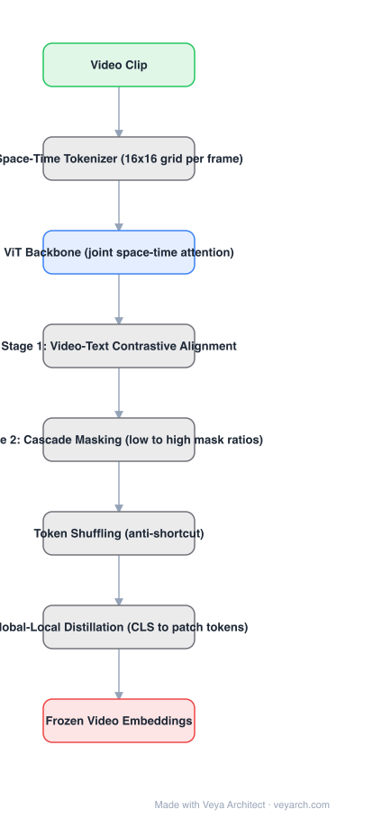

# Architecture: VideoPrism

## Motivation

Video foundation models face a data dilemma: video-text pairs are informative but scarce and caption-noisy; raw video is abundant but unsupervised. Contrastive-only training inherits caption bias and weak temporal modeling; masked-video-only training scales but produces weaker global semantics. VideoPrism asks how to combine both regimes in **one frozen encoder** that a downstream system can use as a universal visual front-end.

## Core Idea

Pretrain in two stages with a cascade of masking regimes. First align video and text (contrastive, 36M pairs). Then scale onto 582M noisier clips with **masked video modeling**, where **cascade masking** samples per-example mask ratios spanning low→high, so the model continuously interpolates between global alignment and dense spatio-temporal prediction. Two fixes keep the masked stage healthy: **token shuffling** destroys low-level shortcuts, and **global-local distillation** pushes the contrastive stage's global semantics into every local token.

## Architecture

### Overview

<b>Layer-by-layer (8 nodes)</b>

| # | Layer | Type | Params |
|---|---|---|---|
| 1 | Video Clip | `input` |  |
| 2 | Space-Time Tokenizer (16×16 per-frame grid) | `custom` |  |
| 3 | ViT Backbone (joint space-time attention) | `attention` |  |
| 4 | Stage 1: Video-Text Contrastive Alignment | `custom` |  |
| 5 | Stage 2: Cascade Masking (low → high mask ratios) | `custom` |  |
| 6 | Token Shuffling (anti-shortcut) | `custom` |  |
| 7 | Global-Local Distillation (CLS → patch tokens) | `custom` |  |
| 8 | Frozen Video Embeddings | `output` |  |

### Components

1. **Space-time tokenizer** — video to tokens on a 16×16 spatial grid per frame (288×288 input, ≈18px patches); temporal position embeddings interpolate to arbitrary frame counts at inference.
2. **ViT backbone** — ViT-B (114M) or ViT-L (354M); joint space-time attention over the token grid; training uses 16 frames (B) / 8 frames (L).
3. **Stage 1 — contrastive alignment** — video encoder + text encoder (dual tower) trained on 36M video-caption pairs; also initialized from large-scale image-text data (WebLI).
4. **Stage 2 — masked video modeling at scale** — 582M clips with noisy parallel text (e.g., ASR); **cascade masking** samples the mask ratio per example across a wide range, cascading between contrastive-like and fully-masked regimes.
5. **Token shuffling** — randomly permutes token order inside the masked-modeling objective so the model cannot exploit local adjacency/copy shortcuts and must learn semantic spatio-temporal features.
6. **Global-local distillation** — distills the global embedding into local patch embeddings so each frozen token carries global semantics (helps retrieval and localization).
7. **LvT dual-tower variant** — video + text encoders with cosine-similarity scoring for text-video retrieval.

### Data Flow

Video → space-time tokens → ViT → embeddings. Stage 1: contrastive loss against caption text. Stage 2: predict masked tokens under cascade mask ratios, with token shuffling and global-local distillation; noisy parallel text supplies weak supervision. Downstream: frozen embeddings → light task heads (linear probes, retrieval towers, QA adapters).

### State / Memory

No recurrent state; a clip is encoded in one forward pass. Temporal information lives in the token sequence and temporal position embeddings, not in carried state.

## Design Decisions

- **Video-first, text-assisted** — the second stage deliberately dwarfs the paired data with video-only data, so the representation is not caption-bounded.
- **Cascade instead of separate objectives** — one schedule interpolating mask ratios beats alternating independent losses; the model is never forced to forget the contrastive regime.
- **Shuffle to prevent shortcuts** — masked spatio-temporal modeling otherwise learns low-level frame-completion tricks.
- **Distill global into local** — makes a *frozen* encoder useful for dense/local tasks without fine-tuning.

## Evolution

- **Predecessors**: CLIP (image-text contrastive) and its video descendants (VideoCLIP-style alignment); masked video modeling (VideoMAE).
- **VideoPrism** (2024): two-stage video-first recipe; frozen encoder, 31/33 benchmark SOTA at publication.
- **Sibling**: V-JEPA 2 — also a frozen video foundation model, but trained by *latent* prediction with no pixel/token reconstruction and no text tower in pretraining; the two are the main "video CLIP moment" candidates.
- **Downstream**: frozen video front-ends for QA and science benchmarks; reference encoder design for multimodal systems needing one video tower.

## Characteristics

| Property | Value |
|---|---|
| Task | general video representation (frozen evaluation) |
| Tokenizer | space-time, 16×16 grid/frame, 288×288 input |
| Backbone | ViT-B 114M / ViT-L 354M (+ LvT dual-tower 248M/580M) |
| Pretraining | contrastive (36M pairs) → cascade-masked MVM (582M clips) |
| Extras | token shuffling, global-local distillation |
| Reported | SOTA on 31 of 33 benchmarks |

## Limitations

- 288px input resolution caps fine-grained spatial detail; not aimed at dense prediction like depth.
- Text tower is English-centric; paired-data bias survives in stage 1.
- Frozen-encoder focus: strong probing results, but generative capability is absent by design.
- Official release is JAX/Flax; the video-text paired corpora are not public.

## Implementation Notes

Essentials: (1) pretrain the contrastive stage first and keep its global embedding as the distillation source, (2) in the masked stage sample the mask ratio per example across a wide range rather than fixing it, (3) shuffle tokens within the masked-modeling objective, (4) distill the global embedding into patch tokens before freezing. The cascade insight generalizes: instead of choosing between alignment and prediction objectives, schedule across them.

## Relevance to Veya

The reference design for "**one frozen video latent + light task heads**" — exactly the shape Veya needs for temporal perception (Veya-Track / Veya-World perception front-end). Three knobs transfer directly: cascade masking as a schedule for mixing alignment and prediction objectives, token shuffling as an anti-shortcut regularizer for any spatio-temporal masked modeling Veya trains, and global-local distillation as a way to keep frozen local tokens semantically loaded so dense heads can ride on the same backbone as retrieval heads.
