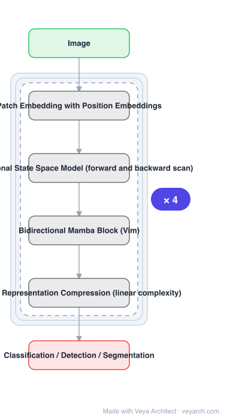

# Architecture: Vision Mamba

## Motivation

SSMs with efficient hardware-aware designs — Mamba — showed great potential for **long sequence modelling**. Building efficient and generic vision backbones **purely upon SSMs** is therefore appealing. But representing visual data is challenging for SSMs for two named reasons: the **position-sensitivity of visual data**, and the **requirement of global context** for visual understanding.

## Core Idea

Show that **reliance on self-attention is not necessary**. Mark image sequences with **position embeddings** (handling position-sensitivity) and compress the visual representation with **bidirectional state space models** (handling global context, since a unidirectional scan only sees one side). This is Vim, a generic vision backbone of bidirectional Mamba blocks.

## Architecture

### Overview

<b>Layer-by-layer (6 nodes)</b>

| # | Layer | Type | Params |
|---|---|---|---|
| 1 | Image | `input` |  |
| 2 | Patch Embedding with Position Embeddings | `custom` |  |
| 3 | Bidirectional State Space Model (forward and backward scan) | `custom` |  |
| 4 | Bidirectional Mamba Block (Vim) | `custom` |  |
| 5 | Visual Representation Compression (linear complexity) | `custom` |  |
| 6 | Classification / Detection / Segmentation | `output` |  |

### Components

1. **Patch embedding** — images are converted into sequences as in ViT; the input to the SSM stack.
2. **Position embeddings** — image sequences are marked with them; this is the explicit answer to SSM position-sensitivity.
3. **Bidirectional state space model** — the core: the sequence is scanned **forward and backward**, so each token has context from both directions, which supplies the global context visual understanding needs.
4. **Bidirectional Mamba block (Vim)** — the repeated unit combining the above with the Mamba selective scan.
5. **Linear-complexity representation compression** — the visual representation is compressed with SSMs, which is where the compute and memory advantage over attention comes from.

### Data Flow

Image → patch embedding → mark with position embeddings → stack of bidirectional Mamba blocks (forward scan and backward scan, results combined) → task head for classification, detection or segmentation.

### State / Memory

The SSM carries a recurrent hidden state along the scan — this is the defining difference from attention, and the reason memory scales linearly rather than quadratically. Bidirectionality means two scans' worth of state rather than one.

## Design Decisions

- **Purely SSM, no attention** — the claim being tested is that attention is not necessary; mixing it back in would not demonstrate that.
- **Bidirectional rather than unidirectional** — chosen specifically to supply global context, which unidirectional SSM scanning cannot provide.
- **Position embeddings are mandatory, not optional** — position-sensitivity of visual data is named as the obstacle, so marking position is load-bearing.
- **Target high resolution** — the reported efficiency numbers are at 1248×1248, which is where attention's cost becomes prohibitive.
- **Validate on three tasks** — classification, detection and segmentation, to support the generic-backbone claim.

## Evolution

- **LSSL, S4, DSS, S4D** (predecessors): structured SSMs for long-range dependencies.
- **Mamba** (predecessor): time-varying parameters plus a hardware-aware algorithm.
- **2-D SSM, SGConvNeXt, ConvSSM** (contrast): combine SSM with CNN or Transformer for 2-D data.
- **Vision Mamba (2024)**: bidirectional Mamba blocks with position embeddings.
- **Siblings**: LocalMamba, VMamba, MambaVision.
- **Contrast**: DeiT and Vision Transformers — outperformed while Vim is 2.8× faster and saves 86.8% GPU memory.

## Characteristics

| Property | Value |
|---|---|
| Task | classification / detection / segmentation |
| Backbone | purely SSM, attention-free |
| Core unit | bidirectional Mamba block |
| Position | explicit position embeddings on image sequences |
| Complexity | linear; 2.8× faster than DeiT, 86.8% GPU memory saved at 1248×1248 |
| Compared against | DeiT (higher accuracy on ImageNet, COCO, ADE20K) |

## Limitations

- Bidirectional scanning doubles the scan work per token compared with unidirectional SSM.
- Sequence flattening still makes distant neighbouring tokens far apart in 1-D order — the problem LocalMamba directly addresses.
- SSM state compression can lose fine detail needed for dense pixel-level prediction.
- Hardware efficiency depends on the availability of an optimized selective-scan kernel; without it the theoretical speed advantage may not materialize.

## Implementation Notes

Essentials: (1) scan in **both directions** and combine — a single forward scan is a plain Vision Mamba variant, and bidirectionality is what supplies the global context that the paper names as required, (2) always mark image sequences with position embeddings; dropping them reintroduces the position-sensitivity problem the paper identifies, (3) keep the backbone attention-free if the goal is to reproduce the claim — the point being demonstrated is that attention is unnecessary, (4) benchmark at high resolution (e.g. 1248×1248) where the 2.8× speed and 86.8% memory savings are reported; at 224×224 the advantage is much less visible, (5) verify an optimized selective-scan kernel is available, since the efficiency claim depends on Mamba's hardware-aware algorithm rather than on FLOP counts alone.
