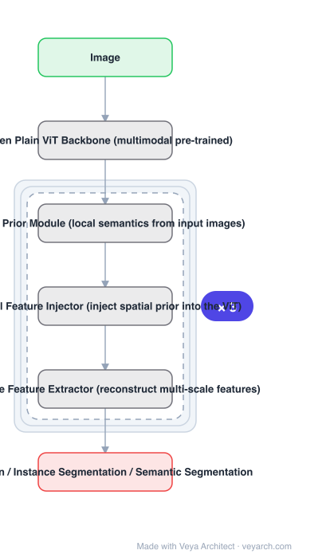

# Architecture: ViT-Adapter

## Motivation

Plain ViT has a conclusive advantage over vision-specific transformers: with **no assumption about input data**, different tokenizers (patch embedding, 3D patch embedding, token embedding) let it be pre-trained on massive **multi-modal** data — image, video and text — learning semantic-rich representations. But it also has conclusive defects on dense prediction: **lacking image-related prior knowledge** it converges slower and performs lower, so plain ViT is hard to compete with vision-specific transformers on detection and segmentation. Retraining the backbone to fix this would throw away the multi-modal pre-training.

## Core Idea

An **adapter**: a **pre-training-free additional network** that adapts a plain ViT to downstream dense prediction **without modifying its original architecture**. Three tailored modules supply the vision-specific inductive biases the plain ViT lacks: a **spatial prior module**, a **spatial feature injector**, and a **multi-scale feature extractor**.

## Architecture

### Overview

<b>Layer-by-layer (6 nodes)</b>

| # | Layer | Type | Params |
|---|---|---|---|
| 1 | Image | `input` |  |
| 2 | Frozen Plain ViT Backbone (multimodal pre-trained) | `custom` |  |
| 3 | Spatial Prior Module (local semantics from input images) | `custom` |  |
| 4 | Spatial Feature Injector (inject spatial prior into the ViT) | `custom` |  |
| 5 | Multi-Scale Feature Extractor (reconstruct multi-scale features) | `custom` |  |
| 6 | Detection / Instance Segmentation / Semantic Segmentation | `output` |  |

### Components

1. **Frozen plain ViT backbone** — multi-modal pre-trained, architecture unchanged; this is the whole point of the adapter approach.
2. **Spatial prior module** — captures local semantics (spatial prior) from the input images; this is the CNN-derived knowledge the plain ViT lacks.
3. **Spatial feature injector** — incorporates the spatial prior into the ViT, injecting it at the transformer layers.
4. **Multi-scale feature extractor** — reconstructs the multi-scale features dense prediction requires, which a plain single-resolution ViT does not produce.
5. **Dense prediction heads** — detection, instance segmentation and semantic segmentation on top of the reconstructed features.

### Data Flow

Image → spatial prior module (local semantics) alongside the ViT's patch embedding → spatial feature injector inserts the prior into ViT layers → plain ViT (frozen) → multi-scale feature extractor reconstructs multi-scale features → detection / segmentation heads.

### State / Memory

No recurrent state. The design keeps two parallel paths — the frozen general-purpose backbone and a randomly initialized adapter — which is the mechanism that preserves pre-training while adding image priors.

## Design Decisions

- **Do not modify the backbone** — explicitly pre-training-free and architecture-preserving, so any multi-modal-pretrained ViT can be reused.
- **Supply inductive biases externally** — rather than baking them into the backbone as vision-specific transformers do.
- **Three modules, each with one job** — spatial prior (local semantics), injector (put it in), extractor (get multi-scale out); the split mirrors the three defects being fixed.
- **A new transfer paradigm** — instead of image-pretrain-then-finetune, use a general-purpose backbone plus a randomly initialized adapter at transfer time; called more flexible.
- **Match or beat vision-specific transformers** — the success criterion is comparability with Swin using a plain ViT backbone.

## Evolution

- **Plain ViT** (predecessor): multi-modal capable, weak on dense prediction.
- **NLP adapters (Houlsby et al., Stickland & Murray)** (the inspiration).
- **Vision-specific transformers, e.g. Swin** (contrast): strong on dense prediction but cannot exploit multi-modal pre-training as freely.
- **ViT-Adapter (2022)**: spatial prior module + injector + multi-scale extractor.
- **Siblings**: PVT, Swin V2, MaxViT.

## Characteristics

| Property | Value |
|---|---|
| Task | detection / instance segmentation / semantic segmentation |
| Backbone | plain ViT, frozen and unmodified |
| Adapter | pre-training-free, randomly initialized |
| Module 1 | spatial prior module (local semantics) |
| Module 2 | spatial feature injector |
| Module 3 | multi-scale feature extractor |
| Result | comparable or better than Swin using a plain ViT backbone |

## Limitations

- The adapter adds parameters and compute on top of the backbone; it is additional, not free.
- Requires a strong pre-trained plain ViT; with a weak backbone the adapter cannot supply what pre-training should have.
- Injection points and adapter capacity are design choices that need tuning per backbone.
- Focused on dense prediction; classification gains are not the objective.

## Implementation Notes

Essentials: (1) keep the pre-trained ViT **frozen and architecturally unmodified** — fine-tuning the backbone with architectural changes is the approach this replaces, (2) implement all three modules: spatial prior, injector and multi-scale extractor; each addresses a distinct defect (local semantics, insertion, multi-scale output), (3) initialize the adapter randomly and train only it, since pre-training-free adaptation is the stated property, (4) reconstruct multi-scale features explicitly — a plain ViT outputs single-resolution features that dense heads cannot consume directly, (5) compare against vision-specific transformers such as Swin, not against fine-tuned plain ViT baselines, since matching those is the claim.
