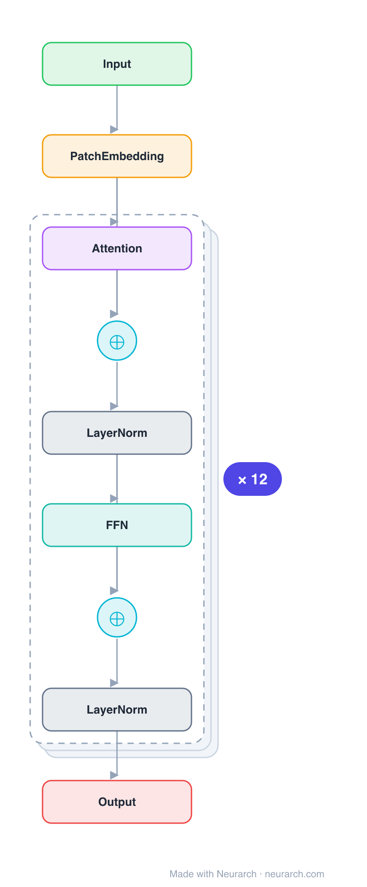

# Architecture: ViT-B/16

## Motivation

The Vision Transformer that ended CNN hegemony in image classification: 16x16 patch embedding, learned position embeddings, and a stack of standard pre-norm Transformer encoder blocks.

## Core Idea

The Vision Transformer that ended CNN hegemony in image classification: 16x16 patch embedding, learned position embeddings, and a stack of standard pre-norm Transformer encoder blocks.

## Architecture

### Overview

*Identical repeated blocks are folded into one representative block with a `× N` badge, so the whole architecture fits on screen. `model.json` uses a NAXS block template + `repeat` directive: the identical repeated layers are defined once and expand to all 75 nodes (open it in Neurarch to see and edit every layer). Vector: [diagram.svg](assets/diagram.svg).*

| Hyperparameter | Value |
|---|---|
| Type | Vision Transformer (image classification) |
| Parameters | 86M |
| Layers | 12 encoder blocks |
| Hidden size | 768 |
| Attention | Multi-head: 12 heads |
| FFN | Dense MLP, 3072, GeLU |
| Normalization | LayerNorm, pre-norm |
| Positions | Learned, 196 patches + class token |
| Patch size | 16x16 over 224x224 input |

`model.json` is the full graph (repeated layers expressed via a NAXS block template + `repeat`), produced with the same import path the Neurarch app uses for "load from Hugging Face".

### Design Notes

- The patch-embed stem is just a strided conv: 3x224x224 becomes 196 patch tokens of 768 dims (plus the class token).
- Identical block to BERT but pre-norm; the inductive-bias-free design needs large-scale pretraining to win.
- The full 12-block stack lives in model.json; the block view shows one encoder block expanded.

### Parameter Check

Neurarch's per-layer parameter estimate over this graph: **85.2M**.
Hugging Face safetensors metadata reports **86.6M** for the real weights.
Deviation from the authoritative count (86.6M): **-1.6%**.

## Design Decisions

> **Analysis** — Observations derived from studying the architecture.

- The patch-embed stem is just a strided conv: 3x224x224 becomes 196 patch tokens of 768 dims (plus the class token).
- Identical block to BERT but pre-norm; the inductive-bias-free design needs large-scale pretraining to win.
- The full 12-block stack lives in model.json; the block view shows one encoder block expanded.

## Implementation Notes

- `model.json` contains the full structural graph with real dimensions and parameters, using a NAXS block template + `repeat` for the identical repeated layers.
- Open in [Neurarch](https://www.neurarch.com/) to visualize, edit, or export training code.
- Diagrams fold repeated identical blocks with a `× N` badge; `model.json` defines each repeated layer once at real dimensions and expands to all nodes.

## Limitations

- This package focuses on the architectural structure. Training pipelines, 
dataset preparation, and production optimizations are out of scope.

## Evolution

> See `references/related/` for predecessor and successor architectures.

