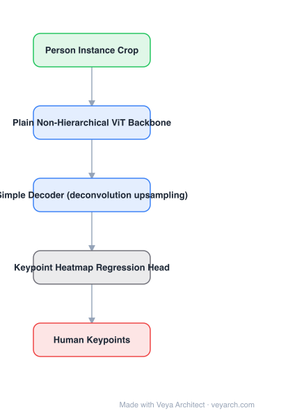

# Architecture: ViTPose

## Motivation

By 2022, top-down pose models carried a lot of inherited machinery — hierarchical backbones with multi-scale fusion, custom decoders, task-specific attention — and it was not clear which parts were responsible for the accuracy. ViTPose asks how much is needed: take a **plain, non-hierarchical vision transformer**, add the **simplest** decoder that works, and see whether backbone capacity alone accounts for the result.

## Core Idea

A plain ViT backbone over the person crop, followed by a **simple decoder** (a few deconvolution layers — or even a single upsampling layer) and a **heatmap regression head**. No multi-scale fusion design, no task-specific modules; the scaling behaviour of the transformer supplies the accuracy.

## Architecture

### Overview

<b>Layer-by-layer (5 nodes)</b>

| # | Layer | Type | Params |
|---|---|---|---|
| 1 | Person Instance Crop | `input` |  |
| 2 | Plain Non-Hierarchical ViT Backbone | `attention` |  |
| 3 | Simple Decoder (deconvolution upsampling) | `conv2d` |  |
| 4 | Keypoint Heatmap Regression Head | `custom` |  |
| 5 | Human Keypoints | `output` |  |

### Components

1. **Plain non-hierarchical ViT backbone** — stacked transformer layers at a single resolution (patch-embedded); no pyramid, no stage-wise downsampling.
2. **Simple decoder** — deconvolution layers upsampling the feature map; the paper shows it can be reduced to a single upsampling layer with modest loss.
3. **Keypoint heatmap head** — predicts one heatmap per keypoint type; argmax/refinement gives keypoint coordinates.
4. **Pretrained initialization** — benefits from MAE-style or ImageNet ViT pretraining; backbone scale is the main quality knob.
5. **Top-down pipeline** — operates on the detected person instance crop (detector is external).

### Data Flow

Image → person detector → crop → plain ViT backbone → simple decoder (upsampling) → keypoint heatmaps → keypoint coordinates.

### State / Memory

No recurrent or temporal state. The single-resolution token grid is the whole internal representation — no multi-scale buffer is maintained.

## Design Decisions

- **Non-hierarchical backbone** — the deliberate simplification: no pyramid features, no fusion stages.
- **Decoder reduced to near-nothing** — the strongest evidence that pose-specific decoder design was not where the accuracy came from.
- **Heatmap output** — the standard keypoint formulation, kept as is.
- **Scale the backbone** — the paper's practical prescription: put compute into the transformer rather than into task modules.
- **Simple baselines as a research tool** — the value is in establishing what is *necessary*, not only in the numbers.

## Evolution

- **SimpleBaseline / Hourglass / HRNet / HRFormer** (predecessors): hierarchical designs with multi-scale fusion.
- **ViTPose (2022)**: plain ViT + simple decoder.
- **Successor / extension**: **ViTPose++** — generic body pose across datasets, larger scale.
- **Siblings**: RTMPose (real-time, efficient), TokenPose (token-based).
- **Trend**: transformer backbones largely displaced HRNet for large-scale pose; HRNet variants remain strong in real-time settings.

## Characteristics

| Property | Value |
|---|---|
| Task | 2D human pose estimation (top-down) |
| Backbone | plain, non-hierarchical ViT |
| Decoder | simple upsampling / deconvolution layers |
| Head | per-keypoint heatmap regression |
| Input | person instance crop (e.g. 256×192) |
| Scaling | accuracy tracks backbone size |

## Limitations

- Top-down: requires person detections, so cost scales with the number of people and detection errors propagate.
- Plain ViTs are expensive at high resolution — real-time use needs a smaller or efficient variant (RTMPose exists for this).
- No temporal modelling; video pipelines need external smoothing.
- 2D only: 3D pose/mesh requires a different head (see mesh-recovery models).

## Implementation Notes

Essentials: (1) use a plain ViT with no pyramid stages, (2) keep the decoder minimal — start with a single upsampling layer and only add deconvolutions if accuracy demands it, (3) regress Gaussian-target heatmaps per keypoint with MSE loss, (4) initialize from a strong ViT pretraining, (5) ablate backbone size against decoder complexity: if adding decoder machinery helps more than scaling the backbone, the premise does not hold for your data.
