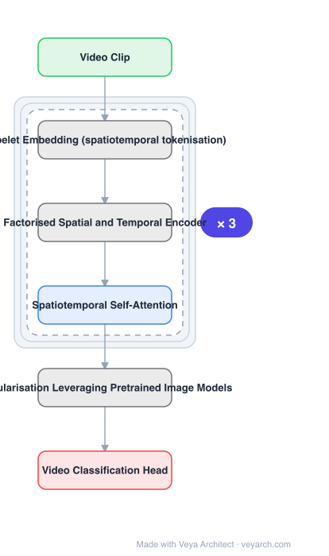

# Architecture: ViViT

## Motivation

Attention is an intuitive choice for modelling long-range contextual relationships in video, and ViT had recently outperformed convolutional counterparts in image classification. But **convolutional models have years of community best practices**, while **pure-transformer models present different characteristics** — so the best design choices for such architectures must be determined, not inherited.

## Core Idea

Develop several transformer-based models for video classification, then determine the design choices by **thorough ablation of tokenisation strategies, model architecture and regularisation methods**. A separate practical problem is addressed too: transformers are known to be effective only with large training datasets, so ViViT shows how to **regularise training** and **leverage pretrained image models** to train on comparatively small datasets.

## Architecture

### Overview

<b>Layer-by-layer (6 nodes)</b>

| # | Layer | Type | Params |
|---|---|---|---|
| 1 | Video Clip | `input` |  |
| 2 | Tubelet Embedding (spatiotemporal tokenisation) | `custom` |  |
| 3 | Factorised Spatial and Temporal Encoder | `custom` |  |
| 4 | Spatiotemporal Self-Attention | `attention` |  |
| 5 | Regularisation Leveraging Pretrained Image Models | `custom` |  |
| 6 | Video Classification Head | `output` |  |

### Components

1. **Tubelet embedding** — the spatiotemporal tokenisation: video is decomposed into tubelets (spatiotemporal patches) rather than 2-D patches.
2. **Factorised encoder** — spatial and temporal dimensions are factorised to increase efficiency, in the transformer context.
3. **Spatiotemporal self-attention** — the transformer encoder over the token sequence.
4. **Regularisation scheme** — the set of methods that make training work without web-scale data.
5. **Pretrained image model initialisation** — leverages image models for video training on smaller datasets.
6. **Classification head** — for video classification benchmarks.

### Data Flow

Video clip → tubelet embedding (spatiotemporal tokens) → factorised spatial-temporal transformer encoder with spatiotemporal self-attention, initialised from a pretrained image model and regularised during training → classification head.

### State / Memory

No recurrent state. The efficiency lever is factorising the spatial and temporal dimensions, which reduces the cost relative to treating the spatiotemporal volume jointly.

## Design Decisions

- **Ablate rather than inherit** — the paper's stated position is that conv best practices do not transfer, so choices are determined empirically.
- **Factorise space and time** — the efficiency mechanism, applied in the transformer setting rather than to convolutions.
- **Tubelet tokenisation** — spatiotemporal tokens rather than frame-level patches; one of the ablated choices.
- **Solve the data-hunger problem explicitly** — regularisation plus pretrained image models, because transformers otherwise need huge datasets.
- **Validate broadly** — Kinetics 400/600, Epic Kitchens 100, Something-Something v2, Moments in Time.

## Evolution

- **Two-stream networks** (predecessor): RGB plus optical flow, fused at the end.
- **Spatiotemporal 3D CNNs** (predecessor): the prior state of the art.
- **Convolution-plus-attention hybrids** (contrast): self-attention added into later ResNet layers.
- **ViT** (predecessor): the pure-transformer image model being extended.
- **ViViT (2021)**: factorised spatiotemporal transformer with ablated design choices.
- **Siblings**: TimeSformer, SlowFast, UniFormer, VideoMAE.
- **Contrast**: deep 3D convolutional architectures — outperformed on the benchmarks above.

## Characteristics

| Property | Value |
|---|---|
| Task | video classification |
| Tokenisation | tubelet embedding (spatiotemporal) |
| Efficiency | factorised spatial and temporal dimensions |
| Design method | thorough ablation (tokenisation, architecture, regularisation) |
| Small-data training | regularisation + pretrained image models |
| Benchmarks | Kinetics 400/600, Epic Kitchens 100, SSv2, Moments in Time |

## Limitations

- Factorisation approximates joint spatiotemporal modelling; some space-time interactions are not directly modelled.
- The design choices are the outcome of a specific ablation; other datasets may favour different settings.
- Depends on pretrained image models for the small-data regime, adding a dependency on image pre-training.
- Tubelet embedding length grows with clip duration, so long clips remain costly.

## Implementation Notes

Essentials: (1) ablate tokenisation, architecture and regularisation rather than porting CNN recipes — the paper's premise is that conv best practices do not transfer to pure-transformer models, (2) tokenise with **tubelets** (spatiotemporal patches), not 2-D frame patches; that is a distinguishing choice under ablation, (3) factorise the spatial and temporal dimensions for efficiency — the efficiency lever, applied in the transformer context, (4) for smaller datasets, combine explicit regularisation with **initialisation from a pretrained image model**; transformers are otherwise only effective at large data scale, (5) report across several video benchmarks rather than Kinetics alone, since the design choices were selected by ablation and single-benchmark gains do not establish them.
