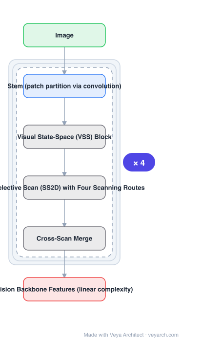

# Architecture: VMamba

## Motivation

Vision backbones trade off two properties. CNNs are efficient; ViTs learn better at scale thanks to self-attention, but self-attention is **quadratic in the number of tokens**, which is punishing at the large spatial resolutions dense prediction needs. Prior efficiency fixes fail one of two ways: they **restrict the effective receptive field**, or they **degrade performance across tasks**. Mamba offered linear-complexity long-sequence modelling in NLP — but a 1D selective scan is inherently *ordered*, while 2D vision data is not sequential. Bridging that gap is the problem.

## Core Idea

**VMamba**: a vision backbone whose core is a stack of **Visual State-Space (VSS) blocks** built on the **2D Selective Scan (SS2D)** module. SS2D traverses **four scanning routes**, reconciling the ordered 1D scan with non-sequential 2D structure and letting the block collect context from multiple directions. The target is to keep vanilla self-attention's advantages — global receptive field and dynamic weighting — at linear complexity.

## Architecture

### Overview

<b>Layer-by-layer (6 nodes)</b>

| # | Layer | Type | Params |
|---|---|---|---|
| 1 | Image | `input` |  |
| 2 | Stem (patch partition via convolution) | `conv2d` |  |
| 3 | Visual State-Space (VSS) Block | `custom` |  |
| 4 | 2D Selective Scan (SS2D) with Four Scanning Routes | `custom` |  |
| 5 | Cross-Scan Merge | `custom` |  |
| 6 | Vision Backbone Features (linear complexity) | `output` |  |

### Components

1. **Stem** — patch partition, implemented convolutionally.
2. **Visual State-Space (VSS) block** — the building block of the network.
3. **2D Selective Scan (SS2D)** — the module at the core of each VSS block; traverses four scanning routes to bridge 1D order and 2D structure, facilitating context collection from various sources and perspectives.
4. **Cross-scan merge** — recombines the outputs of the scanning routes.
5. **Architectural and implementation enhancements** — a succession of optimizations applied to accelerate the family.
6. **VMamba family** — multiple capacity variants built from VSS blocks.

### Data Flow

Image → stem patch partition → stacked VSS blocks (each: SS2D over four scan routes → cross-scan merge → projection) → vision backbone features for perception tasks.

### State / Memory

The SSM hidden state is the mechanism: each scan route carries a recurrent state along its traversal, which is what gives linear rather than quadratic complexity. Four routes means four traversals whose states are merged.

## Design Decisions

- **Four scanning routes** — the concrete answer to 1D-order-versus-2D-structure; multiple directions are how context from "various sources and perspectives" is obtained.
- **Keep global receptive field and dynamic weights** — the stated reason for not simply using a cheaper fixed-receptive-field alternative.
- **Linear complexity in token count** — the property that makes high-resolution input affordable; "superior input scaling efficiency" is highlighted as the headline result.
- **Optimize implementation, not just architecture** — acceleration comes from both.

## Evolution

- **CNNs and ViTs** (the two incumbent backbone families).
- **Efficient-attention variants** (contrast): either restrict receptive field or degrade across tasks.
- **Mamba (NLP SSM)** (predecessor): linear-complexity selective scan for sequences.
- **VMamba (2024)**: VSS blocks with SS2D.
- **Siblings**: Vim, LocalMamba, MambaVision.
- **Successors**: MambaVision (hybrid Mamba-Transformer, redesigned block).

## Characteristics

| Property | Value |
|---|---|
| Task | general vision backbone |
| Core block | Visual State-Space (VSS) block |
| Core module | 2D Selective Scan (SS2D), four scanning routes |
| Complexity | linear in token count |
| Preserves | global receptive field, dynamic weighting |
| Strength | superior input scaling efficiency vs benchmark models |

## Limitations

- Four scan routes multiply traversal work by four, so linear complexity comes with a constant factor.
- SSM sequential scans are harder to parallelize than attention on some accelerators.
- The scan-order design is heuristic; non-sequential 2D structure is only approximated by the chosen routes.
- Reported gains are architectural; real speed depends on optimized scan kernels being available.

## Implementation Notes

Essentials: (1) implement SS2D with all four scan directions and a cross-scan merge — dropping routes removes the mechanism that bridges 1D order and 2D structure, (2) keep the selective-scan state as the complexity advantage; do not fall back to attention, (3) verify the scaling behaviour by sweeping input resolution, since "superior input scaling efficiency" is the headline property and a single-resolution benchmark cannot show it, (4) use the documented architectural and implementation enhancements — the reported speed needs both, (5) evaluate across several perception tasks, because the paper's critique of prior efficient attention is exactly that they degrade on some tasks.
