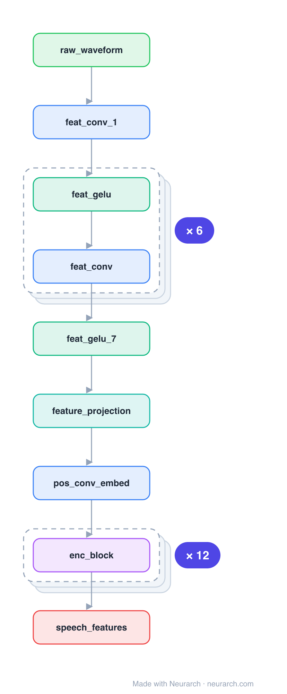

# Architecture: Wav2Vec2 base

## Motivation

The model that made self-supervised speech work: a convolutional feature extractor turns the raw 16kHz waveform into latent frames, a Transformer contextualizes them, and contrastive masked prediction over a learned codebook does the pretraining. Fine-tune with a tiny head and it beats systems trained on 100x the labels.

## Core Idea

The model that made self-supervised speech work: a convolutional feature extractor turns the raw 16kHz waveform into latent frames, a Transformer contextualizes them, and contrastive masked prediction over a learned codebook does the pretraining.

## Architecture

### Overview

*Identical repeated blocks are folded into one representative block with a `× N` badge, so the whole architecture fits on screen. `model.json` uses NAXS block templates + `repeat` directives and expands back to all 30 nodes (open it in Neurarch to see and edit every layer). Vector: [diagram.svg](assets/diagram.svg).*

| Hyperparameter | Value |
|---|---|
| Type | Self-supervised speech encoder |
| Parameters | 95M |
| Feature extractor | 7 Conv1D layers (raw waveform → 20ms frames) |
| Encoder | 12 Transformer blocks, 768 hidden, 12 heads |
| Positions | Convolutional positional embedding |
| Pretraining | Contrastive masked prediction over quantized latents |

`model.json` is the full graph, hand-built against the official config.json.

### Design Notes

- The 7-layer conv stack is the audio analogue of patch embedding: it downsamples raw audio to ~50 frames/sec before the Transformer ever sees it.
- Positions come from a depthwise conv over the sequence (a convolutional positional embedding), not sinusoids.
- Compare with [whisper-small](../whisper-small/): both put a conv stem before a Transformer, but Whisper is supervised seq2seq while Wav2Vec2 is self-supervised representation learning.

### Parameter Check

Neurarch's per-layer parameter estimate over this graph: **165.7M**.

## Design Decisions

> **Analysis** — Observations derived from studying the architecture.

- The 7-layer conv stack is the audio analogue of patch embedding: it downsamples raw audio to ~50 frames/sec before the Transformer ever sees it.
- Positions come from a depthwise conv over the sequence (a convolutional positional embedding), not sinusoids.
- Compare with [whisper-small](../whisper-small/): both put a conv stem before a Transformer, but Whisper is supervised seq2seq while Wav2Vec2 is self-supervised representation learning.

## Implementation Notes

- `model.json` contains the full structural graph with real dimensions and parameters, using NAXS block templates + `repeat` for repeated units.
- Open in [Neurarch](https://www.neurarch.com/) to visualize, edit, or export training code.
- Diagrams fold repeated identical blocks with a `× N` badge; `model.json` defines each repeated unit once at real dimensions and expands to all nodes.

## Limitations

- This package focuses on the architectural structure. Training pipelines, 
dataset preparation, and production optimizations are out of scope.

## Evolution

> See `references/related/` for predecessor and successor architectures.

