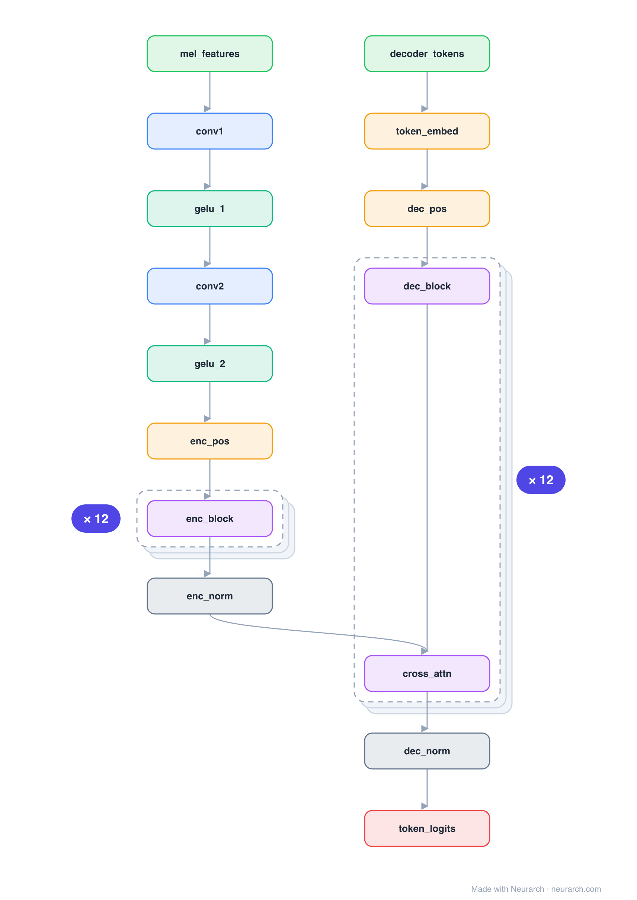

# Architecture: Whisper Small

## Motivation

OpenAI's speech recognition encoder-decoder: log-mel spectrogram through a two-layer conv stem into a 12-block Transformer encoder, with a 12-block causal text decoder cross-attending to the audio states.

## Core Idea

OpenAI's speech recognition encoder-decoder: log-mel spectrogram through a two-layer conv stem into a 12-block Transformer encoder, with a 12-block causal text decoder cross-attending to the audio states.

## Architecture

### Overview

*Identical repeated blocks are folded into one representative block with a `× N` badge, so the whole architecture fits on screen. `model.json` keeps all 48 nodes (open it in Neurarch to see and edit every layer). Vector: [diagram.svg](assets/diagram.svg).*

| Hyperparameter | Value |
|---|---|
| Type | Speech-to-text encoder-decoder |
| Parameters | 244M |
| Layers | 12 encoder + 12 decoder |
| Hidden size | 768 |
| Attention | 12 heads; decoder adds cross-attention |
| FFN | Dense MLP, 3072, GeLU |
| Audio stem | Two Conv1D layers (80-mel input, 2x downsample) |
| Positions | Sinusoidal (encoder), learned (decoder) |
| Vocabulary | 51,865 |

`model.json` is the full graph, hand-built against the official config.json.

### Design Notes

- The conv stem (two 1D convs with GeLU) downsamples the 80-channel mel input 2x before the encoder; everything after is a vanilla Transformer.
- Trained on 680k hours of weakly supervised audio; the architecture is intentionally boring so the data does the work.
- The full graph carries all 12 encoder blocks and 12 decoder blocks, each decoder block with its own cross-attention into the encoder output.

### Parameter Check

Neurarch's per-layer parameter estimate over this graph: **240.2M**.
Deviation from the authoritative count (241.7M): **-0.6%**.

> Whisper ties the decoder token embedding to the output projection; the graph omits a separate LM-head node accordingly.

## Design Decisions

> **Analysis** — Observations derived from studying the architecture.

- The conv stem (two 1D convs with GeLU) downsamples the 80-channel mel input 2x before the encoder; everything after is a vanilla Transformer.
- Trained on 680k hours of weakly supervised audio; the architecture is intentionally boring so the data does the work.
- The full graph carries all 12 encoder blocks and 12 decoder blocks, each decoder block with its own cross-attention into the encoder output.

## Implementation Notes

- `model.json` contains the full structural graph with real dimensions and parameters.
- Open in [Neurarch](https://www.neurarch.com/) to visualize, edit, or export training code.
- Diagrams fold repeated identical blocks with a `× N` badge; `model.json` holds all nodes at real dimensions.

## Limitations

- This package focuses on the architectural structure. Training pipelines, 
dataset preparation, and production optimizations are out of scope.

## Evolution

> See `references/related/` for predecessor and successor architectures.

