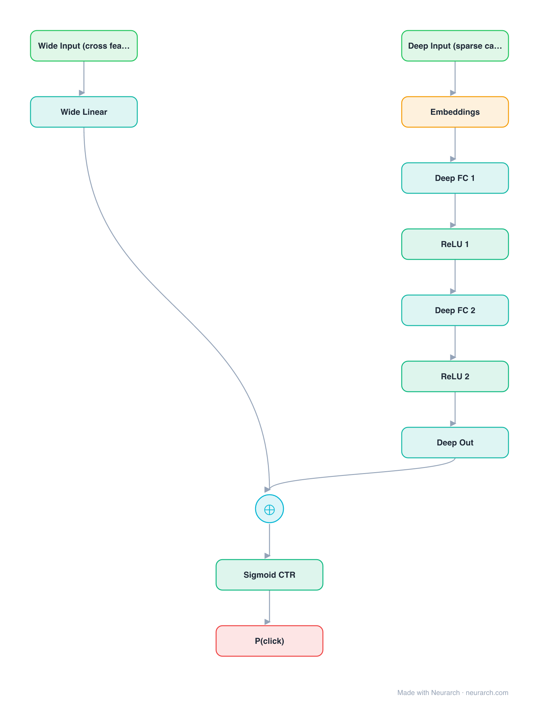

# Architecture: Wide & Deep

## Motivation

Google's Play-store ranking model that joint-trains a wide linear path (memorization of cross features) with a deep embedding MLP (generalization), summed at the logit.

## Core Idea

Google's Play-store ranking model that joint-trains a wide linear path (memorization of cross features) with a deep embedding MLP (generalization), summed at the logit.

## Architecture

### Overview

<b>Layer-by-layer (12 nodes)</b>

| # | Layer | Type | Params |
|---|---|---|---|
| 1 | Wide Input (cross feats) | `input` | shape: [10000] |
| 2 | Wide Linear | `linear` | inFeatures: 10000, outFeatures: 1 |
| 3 | Deep Input (sparse cat) | `input` | shape: [50] |
| 4 | Embeddings | `embedding` | vocabSize: 100000, embeddingDim: 32 |
| 5 | Deep FC 1 | `linear` | inFeatures: 1600, outFeatures: 256 |
| 6 | ReLU 1 | `relu` |   |
| 7 | Deep FC 2 | `linear` | inFeatures: 256, outFeatures: 128 |
| 8 | ReLU 2 | `relu` |   |
| 9 | Deep Out | `linear` | inFeatures: 128, outFeatures: 1 |
| 10 | Wide + Deep | `add` |   |
| 11 | Sigmoid CTR | `sigmoid` |   |
| 12 | P(click) | `output` |   |

This graph ships in Neurarch's in-app template library; the copy here passes shape propagation with zero errors.

### Design Notes

- The wide path memorizes specific feature crosses; the deep path generalizes to unseen ones; the sum gets both behaviors in one model.
- The conceptual ancestor of DeepFM, DCN, and most hybrid CTR architectures since.

## Design Decisions

> **Analysis** — Observations derived from studying the architecture.

- The wide path memorizes specific feature crosses; the deep path generalizes to unseen ones; the sum gets both behaviors in one model.
- The conceptual ancestor of DeepFM, DCN, and most hybrid CTR architectures since.

## Implementation Notes

- `model.json` contains the full structural graph with real dimensions and parameters.
- Open in [Neurarch](https://www.neurarch.com/) to visualize, edit, or export training code.
- Diagrams fold repeated identical blocks with a `× N` badge; `model.json` holds all nodes at real dimensions.

## Limitations

- This package focuses on the architectural structure. Training pipelines, 
dataset preparation, and production optimizations are out of scope.

## Evolution

> See `references/related/` for predecessor and successor architectures.

