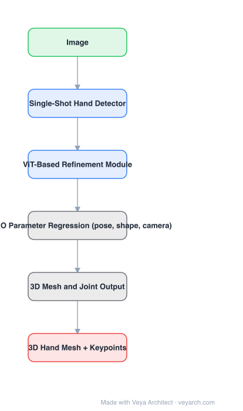

# Architecture: WiLoR

## Motivation

Hand reconstruction pipelines are cascades: detect a hand, crop it, then regress a mesh. The cascade fails exactly where real data is hardest — occlusion, hand-object interaction, two hands, extreme crops — because the crop step has already thrown away the context needed to recover the hand. WiLoR's goal is end-to-end reconstruction that survives in-the-wild images.

## Core Idea

A **single-shot** design: one network localizes hands and regresses **MANO** parameters directly, followed by a **ViT-based refinement module** that re-attends to image features around the estimate and improves the mesh. Training on large in-the-wild data (with multi-view supervision) is what supplies robustness.

## Architecture

### Overview

<b>Layer-by-layer (6 nodes)</b>

| # | Layer | Type | Params |
|---|---|---|---|
| 1 | Image | `input` |  |
| 2 | Single-Shot Hand Detector | `conv2d` |  |
| 3 | ViT-Based Refinement Module | `attention` |  |
| 4 | MANO Parameter Regression (pose, shape, camera) | `custom` |  |
| 5 | 3D Mesh and Joint Output | `custom` |  |
| 6 | 3D Hand Mesh + Keypoints | `output` |  |

### Components

1. **Single-shot hand detector** — produces hand boxes and an initial estimate in one pass; no separate crop stage.
2. **MANO parameter regression head** — predicts pose, shape and camera parameters of the parametric hand model, so the output is a full 3D mesh rather than only joints.
3. **ViT-based refinement module** — a transformer that samples image features (and the current estimate) and refines the parameters; this is the part that recovers occluded and truncated hands.
4. **3D mesh / joint output** — MANO forward model turns parameters into vertices and keypoints.
5. **Training data and supervision** — large in-the-wild datasets with 2D/3D supervision; robustness comes from data diversity as much as architecture.

### Data Flow

Image → detector → initial hand hypothesis + MANO parameters → ViT refinement (attends over image features) → refined pose/shape/camera → MANO → 3D mesh and keypoints.

### State / Memory

No temporal state (per-image). The parametric MANO model is the persistent structure: the network predicts a low-dimensional parameter vector, not vertices.

## Design Decisions

- **End-to-end, no cascade** — avoids the information loss of cropping.
- **Predict MANO parameters, not vertices** — low-dimensional, parametric, and directly usable downstream.
- **Transformer refinement** — attention over image features lets the model use context around the hand, which is what occlusion cases need.
- **In-the-wild data** — the failure modes are data problems as much as model problems.

## Evolution

- **MANO (2017)** (foundation): the parametric hand model.
- **FrankMocap / Mesh Graphormer / METRO / Hand4Whole**: crop-and-regress or graph-transformer pipelines.
- **HaMeR (2023)**: ViT-based full-body/hand mesh recovery, a strong prior for the refinement idea.
- **WiLoR (2024)**: end-to-end localization + MANO regression + ViT refinement for in-the-wild hands.
- **Siblings**: HaMeR, Hand4Whole, InterHand; downstream: embodied/robotics perception (teleoperation, manipulation datasets).

## Characteristics

| Property | Value |
|---|---|
| Task | 3D hand localization + reconstruction |
| Paradigm | single-shot end-to-end |
| Output representation | MANO parameters (pose, shape, camera) |
| Refinement | ViT-based refinement module |
| Output | 3D hand mesh + keypoints |
| Domain | in-the-wild, occlusion and hand-object interaction |

## Limitations

- Metric scale is ill-posed from a single image; absolute hand size/scale is ambiguous.
- Severe occlusion and heavy hand-object interaction remain failure cases, even with refinement.
- Depends on MANO, so it inherits the model's shape space limits (no accessories, no unusual anatomy).
- Per-image only: no temporal smoothing unless added externally (important for video pipelines).

## Implementation Notes

Essentials: (1) keep the detector and the parameter regressor in one forward pass — do not reintroduce a crop stage, (2) regress MANO pose/shape plus camera parameters and decode with MANO, (3) implement the ViT refinement as attention over image features conditioned on the current estimate, (4) train with in-the-wild data covering occlusion and interaction, (5) for video, add temporal smoothing outside the model — WiLoR itself has none.
