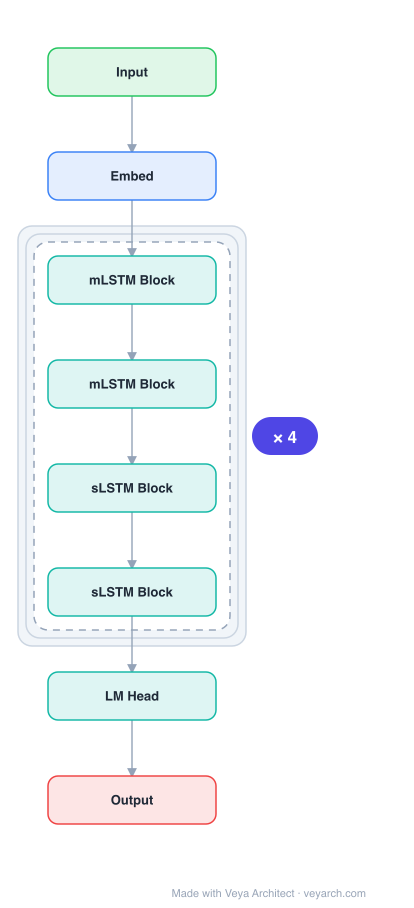

# Architecture: xLSTM

## Motivation

LSTMs have stood the test of time and contributed to numerous deep learning success stories — they constituted the first Large Language Models. However, the advent of Transformer technology with parallelizable self-attention outpaced LSTMs at scale. Despite their successes, LSTMs have three main limitations:

1. **Inability to revise storage decisions** — LSTMs struggle to revise a stored value when a more similar vector is found (Nearest Neighbor Search problem).
2. **Limited storage capacities** — Information must be compressed into scalar cell states, causing poor performance on rare token prediction.
3. **Lack of parallelizability** — Hidden-hidden connections (memory mixing) enforce sequential processing.

xLSTM asks: How far can we get in language modeling when scaling LSTMs to billions of parameters, leveraging modern techniques while mitigating these known limitations?

## Core Idea

Extended LSTM (xLSTM) introduces exponential gating with appropriate normalization and stabilization, and modifies the LSTM memory structure into two variants: (i) **sLSTM** with scalar memory, scalar update, and new memory mixing, and (ii) **mLSTM** that is fully parallelizable with matrix memory and a covariance update rule. These are integrated into residual block backbones and stacked into xLSTM architectures.

## Architecture

### Overview

<b>Layer-by-layer (8 nodes)</b>

| # | Layer | Type | Params |
|---|---|---|---|
| 1 | Input | `input` |  |
| 2 | Embed | `embed` |  |
| 3 | mLSTM Block | `lstm` | memory: matrix, gates: exponential |
| 4 | mLSTM Block | `lstm` | memory: matrix, gates: exponential |
| 5 | sLSTM Block | `lstm` | memory: scalar, gates: exponential |
| 6 | sLSTM Block | `lstm` | memory: scalar, gates: exponential |
| 7 | LM Head | `linear` |  |
| 8 | Output | `output` |  |

xLSTM extends the original LSTM idea (constant error carousel + gating) with two key modifications: exponential gating and novel memory structures. The original LSTM cell state update `c_t = f_t ⊙ c_{t-1} + i_t ⊙ z_t` is enhanced with exponential gates `f_t = exp(f̃_t)`, `i_t = exp(ĩ_t)` (always positive, enabling revision of storage decisions). The two new memory cell variants — sLSTM (scalar, with memory mixing) and mLSTM (matrix, parallelizable) — are integrated into residual blocks and stacked.

### Components

1. **Exponential Gating** — Both sLSTM and mLSTM replace sigmoid gates with exponential gates: `f_t = exp(f̃_t)`, `i_t = exp(ĩ_t)`, `o_t = exp(õ_t)`. This makes gates always positive, enabling the model to revise storage decisions (overcoming limitation (i)). Normalization via the normalizer state `n_t = f_t ⊙ n_{t-1} + i_t` stabilizes the exponential dynamics.

2. **sLSTM (scalar LSTM)** — Retains the scalar memory cell `c_t ∈ R` with the constant error carousel, but adds:
   - Exponential gating (enabling revision)
   - New memory mixing: multiple state transitions to a new memory cell, allowing mixing across cells within a head
   - Multiple heads (without mixing across heads, only across cells within each head)
   - Still sequential (not parallelizable) due to memory mixing

3. **mLSTM (matrix LSTM)** — Replaces the scalar memory cell with a matrix memory cell `C_t ∈ R^{d×d}`:
   - Matrix memory: `C_t = f_t · C_{t-1} + i_t · v_t k_t^T` (covariance/outer product update rule)
   - Abandons memory mixing (hidden-hidden connections) → fully parallelizable
   - Normalizer state: `n_t = f_t · n_{t-1} + i_t`
   - Hidden state: `h_t = o_t ⊙ (C_t · q_t) / max(|n_t|, 1)` where q is a query vector
   - Solves the limited storage capacity problem (limitation (ii))

4. **xLSTM Blocks** — Residual block modules integrating sLSTM and mLSTM:
   - **sLSTM block**: sLSTM with up/down projections and a gated MLP
   - **mLSTM block**: mLSTM with up/down projections, a gated MLP, and a convolution for local context

### Data Flow

**sLSTM:**
1. Input → projections to compute f̃_t, ĩ_t, z_t, õ_t (gate pre-activations)
2. Exponential gates: f_t = exp(f̃_t), i_t = exp(ĩ_t)
3. Normalizer state: n_t = f_t ⊙ n_{t-1} + i_t
4. Cell state: c_t = f_t ⊙ c_{t-1} + i_t ⊙ z_t
5. Hidden state: h_t = (c_t / n_t) (normalized cell state)
6. Output gate: o_t = exp(õ_t), final output = o_t ⊙ h_t

**mLSTM:**
1. Input → projections to compute f̃_t, ĩ_t, k_t, v_t, q_t, õ_t
2. Exponential gates: f_t = exp(f̃_t), i_t = exp(ĩ_t)
3. Normalizer state: n_t = f_t · n_{t-1} + i_t (scalar)
4. Matrix memory: C_t = f_t · C_{t-1} + i_t · v_t k_t^T (outer product update)
5. Query: h_t = (C_t · q_t) / max(|n_t|, 1) (normalized retrieval)
6. Output gate: o_t = exp(õ_t), final output = o_t ⊙ h_t

### State / Memory

- **sLSTM scalar memory**: Cell state `c_t ∈ R` with constant error carousel, enhanced with exponential gating and memory mixing across cells. Retains the original LSTM's stability but with greater expressiveness.
- **mLSTM matrix memory**: Cell state `C_t ∈ R^{d×d}` — a matrix that stores outer products of key-value vectors. This dramatically increases storage capacity (from scalar to d×d matrix), addressing the rare token prediction limitation.
- **Normalizer state**: `n_t` stabilizes the exponential dynamics, preventing overflow and ensuring proper normalization.
- **No hidden-hidden connections in mLSTM**: Enables full parallelization during training (unlike sLSTM and original LSTM).

## Design Decisions

1. **Exponential gating** — Replacing sigmoid (range [0,1]) with exponential (range (0,∞)) gates enables the model to fully open gates and revise storage decisions. This directly addresses the inability to revise (limitation (i)). Normalization via the normalizer state prevents instability.

2. **Matrix memory (mLSTM)** — Replacing the scalar cell state with a d×d matrix dramatically increases storage capacity, addressing the limited storage capacity limitation (limitation (ii)). The covariance (outer product) update rule `C_t = f_t · C_{t-1} + i_t · v_t k_t^T` is a natural generalization.

3. **Abandoning memory mixing in mLSTM** — Removing hidden-hidden connections makes mLSTM fully parallelizable (addressing limitation (iii)), at the cost of losing the recurrent mixing that sLSTM retains.

4. **Two variants (sLSTM + mLSTM)** — Rather than choosing one, xLSTM uses both: sLSTM for sequential tasks requiring memory mixing, mLSTM for parallelizable large-scale processing. This gives flexibility for different use cases.

5. **Residual block backbone** — Integrating LSTM variants into residual blocks (with up/down projections and gated MLPs) aligns with modern LLM architecture practices, enabling scaling to billions of parameters.

6. **Convolution for local context in mLSTM block** — Since mLSTM abandons memory mixing, a local convolution provides short-range context modeling.

## Evolution

**Predecessors:**
- **LSTM** (Hochreiter & Schmidhuber, 1997) — The original constant error carousel and gating, which xLSTM extends.
- **GRU** (Chung et al., 2014) — Simplified LSTM variant.
- **Transformer** (Vaswani et al., 2017) — Outpaced LSTMs at scale through parallelizable self-attention.
- **State Space Models (S4, Mamba)** — Modern recurrent/sequence models that xLSTM competes with.

**Successors:**
- Future xLSTM variants with further architectural improvements.
- Potential hybrid xLSTM-Transformer architectures.

## Characteristics

| Property | Value |
|----------|-------|
| Year | 2024 |
| Authors | Beck, Pöppel, Hochreiter et al. |
| Category | DL/Sequence |
| Source Paper | `xLSTM_Mai_2024.md` |
| PaperVault Path | `DL-Architectures/02-sequence-models/xLSTM_Mai_2024.md` |

## Limitations

1. **sLSTM not parallelizable** — The sLSTM variant retains memory mixing, requiring sequential processing. Only mLSTM is fully parallelizable.
2. **Matrix memory cost** — The mLSTM's d×d matrix memory has O(d²) storage per cell, which can be expensive for large hidden dimensions.
3. **Newer architecture** — Less mature ecosystem and fewer optimized implementations compared to Transformers and even Mamba.
4. **Complexity of two variants** — Having both sLSTM and mLSTM adds architectural complexity; choosing when to use which requires expertise.
5. **Scaling evidence** — While xLSTM shows favorable scaling properties, it has less empirical evidence at the largest scales compared to Transformers.

## Implementation Notes

See `implementation/` for a minimal runnable implementation. Key details:
- Exponential gates: `f_t = exp(f̃_t)`, `i_t = exp(ĩ_t)` (always positive)
- Normalizer state: `n_t = f_t ⊙ n_{t-1} + i_t` (stabilizes exponential dynamics)
- sLSTM: scalar cell state with memory mixing (sequential)
- mLSTM: matrix cell state `C_t = f_t · C_{t-1} + i_t · v_t k_t^T` (parallelizable)
- mLSTM hidden: `h_t = (C_t · q_t) / max(|n_t|, 1)`
- Residual blocks with up/down projections and gated MLPs

## Information Layers

- **Evidence:** Source paper available in `references/papers/` (Beck et al., 2024, "xLSTM: Extended Long Short-Term Memory")
- **Analysis:** xLSTM's two key modifications — exponential gating and matrix memory — directly address the three LSTM limitations. Exponential gating enables revision (always-positive gates can fully open), the matrix memory increases capacity (from scalar to d×d), and abandoning memory mixing in mLSTM enables parallelization. The design is a thoughtful evolution of the original LSTM ideas rather than a departure from them.
- **Hypothesis:** The matrix memory with covariance update rule in mLSTM may be related to attention mechanisms — the outer product `v_t k_t^T` resembles the key-value outer product in attention. This suggests a deep connection between LSTM memory cells and attention, which could lead to unified architectures.
