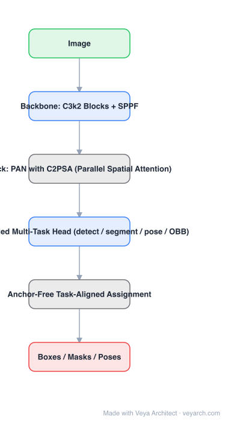

# Architecture: YOLOv11

## Motivation

The YOLO line optimizes one thing: accuracy per unit of latency on commodity hardware. YOLOv11's target is to improve on YOLOv8 **without adding parameters** — the practical constraint is that an edge deployment is bound by memory and bandwidth as much as by FLOPs, so a smaller model at equal or better accuracy is a real win.

## Core Idea

Keep YOLOv8's proven structure — CSP-style backbone, SPPF, PAN neck, anchor-free decoupled head — and change two things: replace the **C2f** block with **C3k2** (a cheaper two-convolution bottleneck that saves parameters), and insert **C2PSA** (CSP block with **parallel spatial attention**) after SPPF so the network can re-weight spatial locations before multi-scale fusion.

## Architecture

### Overview

<b>Layer-by-layer (6 nodes)</b>

| # | Layer | Type | Params |
|---|---|---|---|
| 1 | Image | `input` |  |
| 2 | Backbone: C3k2 Blocks + SPPF | `conv2d` |  |
| 3 | Neck: PAN with C2PSA (Parallel Spatial Attention) | `custom` |  |
| 4 | Decoupled Multi-Task Head (detect / segment / pose / OBB) | `conv2d` |  |
| 5 | Anchor-Free Task-Aligned Assignment | `custom` |  |
| 6 | Boxes / Masks / Poses | `output` |  |

### Components

1. **Backbone: C3k2 blocks** — a CSP-style building block whose bottleneck uses two small convolutions instead of one large one; this is where the parameter reduction (e.g. ~22% fewer parameters for YOLOv11m vs YOLOv8m) comes from.
2. **SPPF** — fast spatial pyramid pooling (successive small pools instead of one large kernel) retained from YOLOv8.
3. **C2PSA** — convolutional block with **parallel spatial attention**: a CSP block whose branches include an attention branch, so both channel and spatial context are mixed before fusion.
4. **PAN neck** — top-down and bottom-up multi-scale feature fusion across P3/P4/P5.
5. **Decoupled anchor-free heads** — separate classification and regression branches; task-aligned assignment selects positives; the same neck feeds detection, segmentation, pose and OBB heads.
6. **Deployment path** — first-party export to ONNX / TensorRT / CoreML is part of the design, not an afterthought.

### Data Flow

Image (640×640) → C3k2 backbone with SPPF → C2PSA → PAN neck → decoupled heads → boxes / masks / poses; NMS (or task-specific post-processing) at the end.

### State / Memory

No recurrent state; the multi-scale feature pyramid (P3–P5) is the only intermediate structure carried through the network.

## Design Decisions

- **Parameter reduction as a first-class goal** — C3k2 exists to cut parameters while holding accuracy.
- **Spatial attention in the neck (C2PSA)** — attention is cheap at low resolution, so put it where the feature map is small.
- **Keep the anchor-free decoupled head** — assignment and head design from YOLOv8 were already the right shape; do not regress them.
- **One backbone, four tasks** — detection, segmentation, pose, OBB share weights, which is the practical reason teams standardize on one YOLO version.
- **Vendor-reported metrics**: the numbers in the overview paper are Ultralytics' own; independent reproduction is worth doing before committing.

## Evolution

- **YOLOv5 / YOLOv8** (predecessors): CSP blocks, SPPF, PAN, anchor-free decoupled head.
- **YOLOv11**: C3k2 + C2PSA, fewer parameters at equal or better accuracy.
- **Successors**: YOLOv12 (attention-centric, R-ELAN / area attention), YOLO26 (NMS-free, training-efficiency focused).
- **Siblings**: RT-DETR / RT-DETRv3 (real-time transformer detectors), D-FINE (distribution refinement), LW-DETR.

## Characteristics

| Property | Value |
|---|---|
| Task | detection / segmentation / pose / OBB |
| Backbone | C3k2 blocks + SPPF |
| Neck | PAN with C2PSA parallel spatial attention |
| Head | decoupled, anchor-free, task-aligned assignment |
| Parameter claim | YOLOv11m ≈ 22% fewer parameters than YOLOv8m |
| Input | 640×640 |

## Limitations

- Attention (C2PSA) and small-convolution blocks do not always translate to real speedups on every accelerator — measure wall-clock, not FLOPs.
- NMS remains in the pipeline, so latency depends on the number of detections.
- The reference paper is an overview, not a full ablation study; several design claims are not independently verified.
- Like all YOLO variants, small-object and crowded-scene accuracy is behind heavy two-stage or transformer detectors.

## Implementation Notes

Essentials: (1) build the backbone from C3k2 blocks (two-conv bottleneck) and keep SPPF, (2) insert C2PSA immediately after SPPF where resolution is lowest, (3) keep the PAN neck and decoupled anchor-free heads, (4) use task-aligned assignment with the same multi-task head stack, (5) benchmark exported models (TensorRT/ONNX) on the actual target — the reported parameter cut only matters if it turns into latency or memory savings there.
