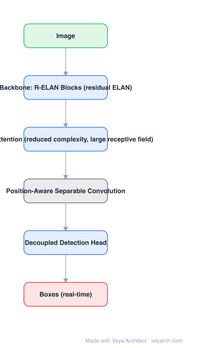

# Architecture: YOLOv12

## Motivation

Attention gives CNNs a global receptive field and better modelling, but in YOLO-scale detectors it historically lost to convolutions on two counts: **speed** (quadratic attention at high resolution) and **optimizability** (attention blocks are unstable to stack deep, and large models failed to converge). YOLOv12's goal is to make attention the *primary* building block without giving up real-time latency.

## Core Idea

Three changes: **R-ELAN** (residual efficient layer aggregation networks) to make attention blocks stackable and optimizable, **area attention** to get a large receptive field at a fraction of the attention cost, and **position-aware separable convolutions** (large-kernel depthwise separable convs) to supply the positional information attention lacks.

## Architecture

### Overview

<b>Layer-by-layer (6 nodes)</b>

| # | Layer | Type | Params |
|---|---|---|---|
| 1 | Image | `input` |  |
| 2 | Backbone: R-ELAN Blocks (residual ELAN) | `conv2d` |  |
| 3 | Area Attention (reduced complexity, large receptive field) | `attention` |  |
| 4 | Position-Aware Separable Convolution | `custom` |  |
| 5 | Decoupled Detection Head | `conv2d` |  |
| 6 | Boxes (real-time) | `output` |  |

### Components

1. **Backbone: R-ELAN blocks** — ELAN-style aggregation with a **block-level residual** and a bottleneck; this is the fix for the optimization instability of attention-centric stacks.
2. **Area attention** — attention computed over areas (horizontal/vertical partitions) instead of the full feature map or fixed local windows: large receptive field, lower complexity than vanilla self-attention, simpler than window shifting.
3. **Position-aware separable convolution** — depthwise separable convolution with a large kernel (7×7-style) providing positional perception cheaply, replacing explicit positional encodings.
4. **Neck (PAN-style)** — multi-scale fusion as in previous YOLOs.
5. **Decoupled anchor-free head** — retained from YOLOv11; multi-task heads for detect/segment/pose/OBB.
6. **FlashAttention implementation** — the reduced-complexity attention is what makes the attention-centric design fit a real-time latency budget.

### Data Flow

Image (640×640) → R-ELAN backbone → PAN neck with area attention → decoupled heads → boxes → NMS.

### State / Memory

No recurrent state; the multi-scale feature pyramid (P3–P5) is the only intermediate structure.

## Design Decisions

- **Attention as the primary block** — the defining departure from YOLOv5–v11.
- **Fix optimizability first (R-ELAN)** — the failure mode of attention-centric YOLO is convergence, not accuracy; the residual+bottleneck redesign addresses it.
- **Reduce attention cost by area partitioning** — keep the receptive field, cut the computation.
- **Convolutions for position** — attention has no positional bias; a cheap separable conv restores it.
- **Keep the proven head** — assignment and head design were already right; do not regress them.

## Evolution

- **YOLOv7 / ELAN / GELAN** (predecessors): efficient layer aggregation.
- **YOLOv8 → YOLOv11**: CNN-based, C3k2 + C2PSA.
- **YOLOv12 (2025)**: attention-centric — R-ELAN, area attention, position-aware separable conv.
- **Successor**: **YOLO26** (NMS-free, unified multi-task).
- **Siblings**: RT-DETR / RT-DETRv3 (transformer detectors), D-FINE, LW-DETR.

## Characteristics

| Property | Value |
|---|---|
| Task | detection / segmentation / pose / OBB (real-time) |
| Backbone | R-ELAN (residual ELAN with bottleneck) |
| Attention | area attention (reduced complexity, large receptive field) |
| Positional info | position-aware depthwise separable convolution |
| Head | decoupled, anchor-free |
| Input | 640×640 |

## Limitations

- Attention modules translate less predictably to latency on edge accelerators than convolutions do — measure on target hardware, not in FLOPs.
- Speed advantage reported against previous YOLO generations at comparable size; against the newest CNN detectors the margin is small.
- Real-time attention requires a compatible kernel (FlashAttention-class); older hardware sees less benefit.
- NMS is still in the pipeline (YOLO26 is the NMS-free successor).

## Implementation Notes

Essentials: (1) build the backbone from R-ELAN blocks with block-level residuals — do not stack plain attention blocks, they will not converge, (2) implement area attention as horizontal/vertical area partitioning and fuse, (3) insert large-kernel depthwise separable convolutions for positional perception, (4) keep the PAN neck and decoupled anchor-free head, (5) benchmark with FlashAttention enabled; the design's latency claim depends on it.
