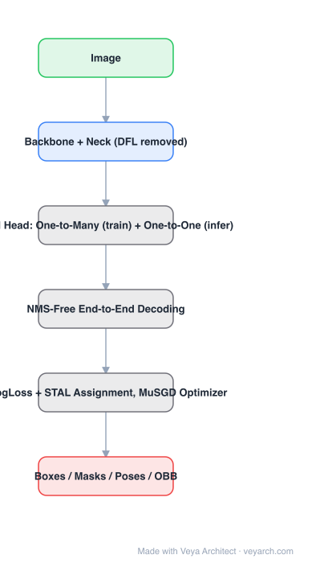

# Architecture: Ultralytics YOLO26

## Motivation

Two things keep a detector from being a clean deployment artifact: **NMS** (whose cost depends on how many objects happen to be in the scene, and which is awkward to export) and **DFL** (Distribution Focal Loss, whose integral over a distribution is slow to decode and hostile to quantization). YOLO26's goal is a real-time detector that decodes **end-to-end without NMS**, exports cleanly, and still trains as well as a one-to-many detector.

## Core Idea

A **dual head**: one-to-many assignment trains the model with dense supervision, a one-to-one branch produces the final predictions and is used at inference — giving **NMS-free end-to-end decoding** without abandoning one-to-many training. DFL is removed outright. Training uses **ProgLoss** (progressive loss balancing), **STAL** (small-target-aware label assignment) and the **MuSGD** optimizer.

## Architecture

### Overview

<b>Layer-by-layer (6 nodes)</b>

| # | Layer | Type | Params |
|---|---|---|---|
| 1 | Image | `input` |  |
| 2 | Backbone + Neck (DFL removed) | `conv2d` |  |
| 3 | Dual Head: One-to-Many (train) + One-to-One (infer) | `custom` |  |
| 4 | NMS-Free End-to-End Decoding | `custom` |  |
| 5 | ProgLoss + STAL Assignment, MuSGD Optimizer | `custom` |  |
| 6 | Boxes / Masks / Poses / OBB | `output` |  |

### Components

1. **Backbone + neck** — inherited end-to-end from the YOLO line, adapted for the new heads; DFL removed from the box representation.
2. **Dual head** — a one-to-many branch (training supervision) and a one-to-one branch (inference), sharing the backbone and neck.
3. **NMS-free end-to-end decoding** — the one-to-one branch emits the final boxes directly, so post-processing is a constant-cost step.
4. **Fallback path** — if a deployment target cannot support E2E decoding, the model falls back to the non-E2E branch with NMS; the paper reports the two are nearly equivalent in accuracy.
5. **ProgLoss** — progressive loss weighting/balancing over training.
6. **STAL (small-target-aware label assignment)** — assignment strategy aimed at the small-object weakness of earlier versions.
7. **MuSGD** — momentum-unified SGD optimizer used for training.
8. **Multi-task outputs** — detection, segmentation, pose and OBB from one model family.

### Data Flow

Image (640×640) → backbone + neck → dual head → one-to-one branch → end-to-end boxes (no NMS), or one-to-many branch → NMS path as fallback.

### State / Memory

No temporal state. Multi-scale features are shared by both head branches; the one-to-many branch exists only in the training graph (or as an explicitly selected fallback).

## Design Decisions

- **NMS-free as the deployment path** — removes a data-dependent, hard-to-export stage.
- **Keep one-to-many supervision** — do not give up dense training signal; the dual head is the compromise.
- **Remove DFL** — simpler decoding and friendlier export/quantization.
- **Explicit fallback** — E2E is the default, NMS remains available; reported accuracy of the two is nearly equivalent.
- **Target small objects** — STAL/ProgLoss address the known weak spot rather than the average case.

## Evolution

- **YOLOv8 → YOLOv11 (CNN, C3k2/C2PSA) → YOLOv12 (attention-centric, R-ELAN)** (predecessors).
- **YOLO26 (Ultralytics, 2026)**: NMS-free E2E dual head, DFL removed, ProgLoss + STAL, MuSGD, unified multi-task.
- **Parallel**: DETR-family (end-to-end by construction), DEYO / RT-DETRv3 (one-to-many training tricks), D-FINE (distribution regression).
- **Contrast**: YOLO26 reaches NMS-free from the CNN side; DETR-family reached it from the transformer side.

## Characteristics

| Property | Value |
|---|---|
| Task | detection / segmentation / pose / OBB |
| Inference decoding | NMS-free end-to-end (one-to-one branch) |
| Training assignment | dual head: one-to-many (train) + one-to-one (infer) |
| Box representation | DFL removed |
| Training aids | ProgLoss, STAL, MuSGD |
| Fallback | non-E2E branch with NMS |

## Limitations

- End-to-end (one-to-one) decoding typically costs some accuracy versus a well-tuned one-to-many + NMS model; the paper reports the gap as small, but it is version-specific.
- E2E decoding must be supported by the export target; otherwise the NMS fallback is used and the deployment advantage disappears.
- ProgLoss/STAL/MuSGD add new hyperparameters to tune.
- Vendor-reported results (Ultralytics); independent reproduction of the latency claims on your accelerator is worthwhile.

## Implementation Notes

Essentials: (1) attach both a one-to-many and a one-to-one head to the shared backbone/neck, (2) train with both losses, use only the one-to-one branch at inference, (3) drop DFL and decode boxes directly, (4) implement the NMS fallback and confirm exports still work on targets without E2E support, (5) report latency at high object counts — that is where NMS-free is supposed to win.
